# BÁO CÁO ĐỒ ÁN TỐT NGHIỆP / CUỐI KỲ

**Tên đề tài**

XÂY DỰNG HỆ THỐNG E-COMMERCE SỬ DỤNG KIẾN TRÚC MICROSERVICES  
VỚI SPRING BOOT + SPRING CLOUD

| Mục | Nội dung |
|-----|----------|
| Sinh viên | Trần Văn Hải |
| Mã SV / lớp | *(điền)* |
| Giảng viên hướng dẫn | *(điền)* |
| Công nghệ chính | Java 21, Spring Boot 3, Spring Cloud, PostgreSQL, RabbitMQ, React |
| Package | `gtvt.haitv.ecommerce` |
| Năm | 2026 |

> Tài liệu này trả lời đúng các câu hỏi đồ án: hệ thống và vấn đề, tác nhân – chức năng, quy trình BPMN, biểu đồ tiêu biểu, và kiến trúc Microservices (khái niệm, lý do chọn, đặc điểm, thành phần, cách hoạt động).  
> Có thể xuất PDF / in để nộp và dùng khi thuyết trình.

---

## Mục lục

1. [Câu 1 — Định xây hệ thống gì? Giải quyết vấn đề gì?](#câu-1--định-xây-hệ-thống-gì-giải-quyết-vấn-đề-gì)
2. [Câu 2 — Tác nhân và chức năng tương ứng](#câu-2--tác-nhân-và-chức-năng-tương-ứng)
3. [Câu 3 — Quy trình nghiệp vụ (BPMN)](#câu-3--quy-trình-nghiệp-vụ-bpmn)
4. [Câu 4 — Biểu đồ tiêu biểu](#câu-4--biểu-đồ-tiêu-biểu)
5. [Phần 2 — Kiến trúc Microservices](#phần-2--kiến-trúc-microservices)
6. [Thiết kế dữ liệu và API](#thiết-kế-dữ-liệu-và-api)
7. [Kịch bản demo](#kịch-bản-demo)
8. [Phân chia công việc](#phân-chia-công-việc)
9. [Kết luận](#kết-luận)

---

# Câu 1 — Định xây hệ thống gì? Giải quyết vấn đề gì?

## 1.1 Hệ thống định xây

Đồ án xây dựng **hệ thống thương mại điện tử một cửa hàng** (single-store e-commerce), cho phép:

- Khách hàng đăng ký, đăng nhập, xem / tìm sản phẩm, thêm vào giỏ, đặt hàng, thanh toán giả lập, theo dõi và hủy đơn khi hợp lệ.
- Quản trị viên quản lý người dùng, danh mục, sản phẩm, tồn kho, đơn hàng và xem thống kê cơ bản.

Hệ thống được tổ chức theo **kiến trúc Microservices**, dùng **Spring Boot + Spring Cloud**, có API Gateway, Service Discovery (Eureka), messaging (RabbitMQ) và **một database logic cho mỗi service**.

Đây không phải marketplace nhiều người bán, không có AI gợi ý, không có cổng thanh toán thật.

## 1.2 Vấn đề cần giải quyết

Một cửa hàng bán online gặp các bài toán thực tế:

| # | Vấn đề | Hệ thống xử lý thế nào |
|---|--------|-------------------------|
| 1 | Khách không thể mua hàng tập trung trên web | Storefront: catalog, giỏ, checkout |
| 2 | Bán vượt tồn kho (oversell) | Inventory tách riêng; reserve trước khi thanh toán; `availableQuantity >= 0` |
| 3 | Thanh toán có thể thất bại | Mock payment; fail thì **release** hàng đã giữ |
| 4 | Giá sản phẩm đổi sau khi đã đặt | Order item **snapshot** tên và giá tại lúc tạo đơn |
| 5 | Thông báo lỗi làm hỏng đơn | Notification chạy bất đồng bộ; lỗi không rollback Order |
| 6 | Admin và Customer quyền khác nhau | JWT + role `CUSTOMER` / `ADMIN` |
| 7 | Catalog, đơn, thanh toán có vòng đời khác nhau | Tách bounded context → từng microservice |

## 1.3 Phạm vi

**Trong phạm vi**

Identity, Product Catalog, Shopping Cart, Inventory, Order, Mock Payment, Notification.

**Ngoài phạm vi**

AI / ML, livestream, chat realtime, multi-vendor, ERP, kế toán, logistics thật, Stripe/PayPal/VNPay production.

## 1.4 Nguyên tắc đồ án

> Đủ đơn giản để hoàn thành. Đủ chắc để bảo vệ.

Không over-engineering: không service mesh, không Kafka, không distributed tracing bắt buộc.

## 1.5 Luồng nghiệp vụ vàng (Golden Path)

Đây là trục của toàn bộ đồ án — mọi BPMN, API, database và demo phải khớp.

```
Customer → Login → Xem sản phẩm → Chi tiết → Thêm giỏ
        → Checkout → Tạo Order → Check tồn kho → Reserve
        → Thanh toán giả lập
              ├─ SUCCESS → Confirm Order → RabbitMQ → Notification
              └─ FAILED  → Release tồn kho → Order PAYMENT_FAILED
```

---

# Câu 2 — Tác nhân và chức năng tương ứng

## 2.1 Danh sách tác nhân

| ID | Tác nhân | Loại | Vai trò |
|----|----------|------|---------|
| ACTOR-01 | Customer | Chính | Người mua hàng |
| ACTOR-02 | Admin | Chính | Quản trị cửa hàng |
| ACTOR-03 | Payment System | Phụ (mock) | Giả lập thanh toán SUCCESS / FAILED |
| ACTOR-04 | Notification System | Phụ | Nhận event, lưu / log thông báo |
| ACTOR-05 | Hạ tầng hệ thống | Phụ | Eureka, Gateway, PostgreSQL, RabbitMQ, Docker |

## 2.2 Customer — chức năng

| Mã | Chức năng | Mô tả ngắn |
|----|-----------|------------|
| FR-01 | Đăng ký | Email duy nhất, mật khẩu hash BCrypt, role mặc định CUSTOMER |
| FR-02 | Đăng nhập | Nhận JWT |
| FR-03 | Xem sản phẩm | Danh sách có phân trang |
| FR-04 | Tìm / lọc sản phẩm | Keyword, category, brand, khoảng giá |
| FR-05 | Xem chi tiết sản phẩm | Một sản phẩm theo id |
| FR-06 | Quản lý giỏ | Thêm, sửa số lượng, xóa item, xóa giỏ |
| FR-07 | Checkout | Giỏ không rỗng + địa chỉ + phương thức thanh toán |
| FR-08 | Tạo đơn | Snapshot item; check + reserve tồn kho |
| FR-09 | Thanh toán | Mock: COD / MOCK_CARD / MOCK_BANKING |
| FR-10 | Xem đơn | Chỉ đơn của chính mình |
| FR-11 | Hủy đơn | Chỉ khi PENDING hoặc PAYMENT_PENDING |
| FR-12 | Theo dõi đơn | PENDING → … → DELIVERED / CANCELLED / PAYMENT_FAILED |

Customer **không** được: CRUD sản phẩm, xem giỏ / đơn của người khác, vào trang admin.

## 2.3 Admin — chức năng

| Mã | Chức năng | Mô tả ngắn |
|----|-----------|------------|
| FR-02 | Đăng nhập | Cùng API login, role ADMIN |
| FR-13 | Quản lý sản phẩm | Tạo / sửa / xóa |
| FR-14 | Quản lý danh mục | Tạo / sửa / xóa |
| FR-15 | Quản lý tồn kho | Xem, cập nhật; hệ thống reserve / release / deduct |
| FR-16 | Quản lý đơn | Xem mọi đơn, đổi trạng thái xử lý / giao |
| — | Quản lý user | Khóa / mở user |
| — | Dashboard | Thống kê cơ bản |

## 2.4 Hệ thống thanh toán và thông báo

**Payment System (mock)** nhận `orderId`, số tiền, phương thức; trả `SUCCESS` hoặc `FAILED`. Dùng để demo cả hai nhánh, không gọi ngân hàng thật.

**Notification System** lắng nghe RabbitMQ: `ORDER_CREATED`, `ORDER_CONFIRMED`, `PAYMENT_SUCCESS`, `PAYMENT_FAILED`, `ORDER_SHIPPED`, `ORDER_DELIVERED`. Lưu DB + log. Lỗi consumer **không** làm fail Order.

## 2.5 Quy tắc nghiệp vụ (cần nhớ khi bảo vệ)

| ID | Quy tắc |
|----|---------|
| BR-01 | Email unique |
| BR-02 | Password hash; không trả về client |
| BR-03 | Chỉ ADMIN CRUD product |
| BR-04 | Customer chỉ xem dữ liệu của mình |
| BR-05 | Giỏ rỗng không checkout |
| BR-06 | Không đủ hàng thì không tạo đơn thành công |
| BR-07 | Không oversell; tồn kho không âm |
| BR-08 | Payment SUCCESS mới confirm order |
| BR-09 | Payment FAILED phải release stock |
| BR-10 | OrderItem lưu giá tại thời điểm đặt |
| BR-11 | Chỉ hủy ở trạng thái hợp lệ |
| BR-12 | Notification fail không rollback Order |

---

# Câu 3 — Quy trình nghiệp vụ (BPMN)

Sáu quy trình dưới đây mô tả hệ thống thực tế của cửa hàng, rút gọn cho đồ án.

## 3.1 BPMN-01 — Đăng ký / Đăng nhập

Người dùng chưa có tài khoản thì đăng ký (email unique, hash mật khẩu). Có tài khoản thì đăng nhập. Hệ thống cấp JWT chứa `userId` và `role`.

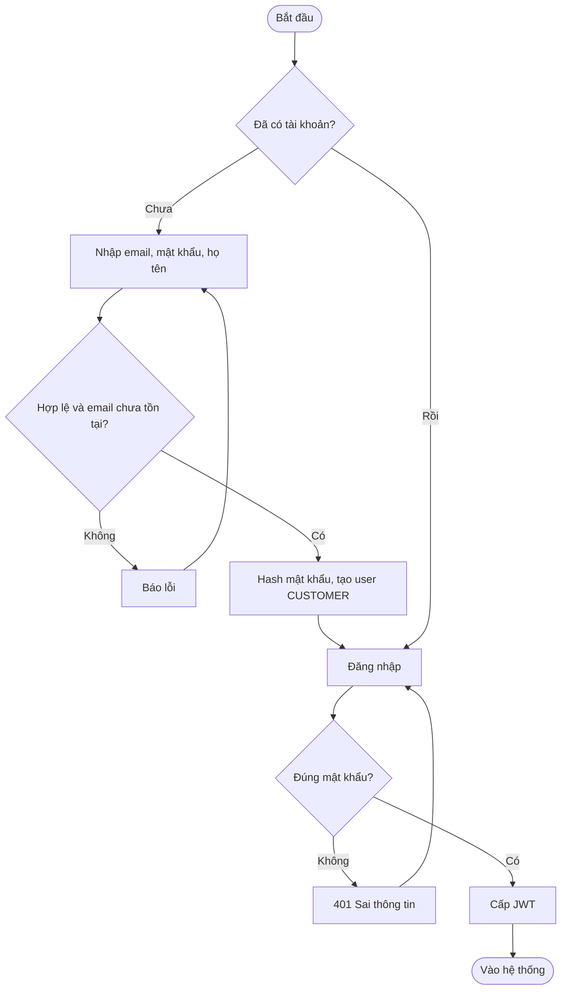

**Điểm bảo vệ:** mật khẩu không log, không trả về API.

## 3.2 BPMN-02 — Quản lý sản phẩm

Customer / khách chỉ **đọc** catalog. Admin mới được thêm, sửa, xóa danh mục và sản phẩm.

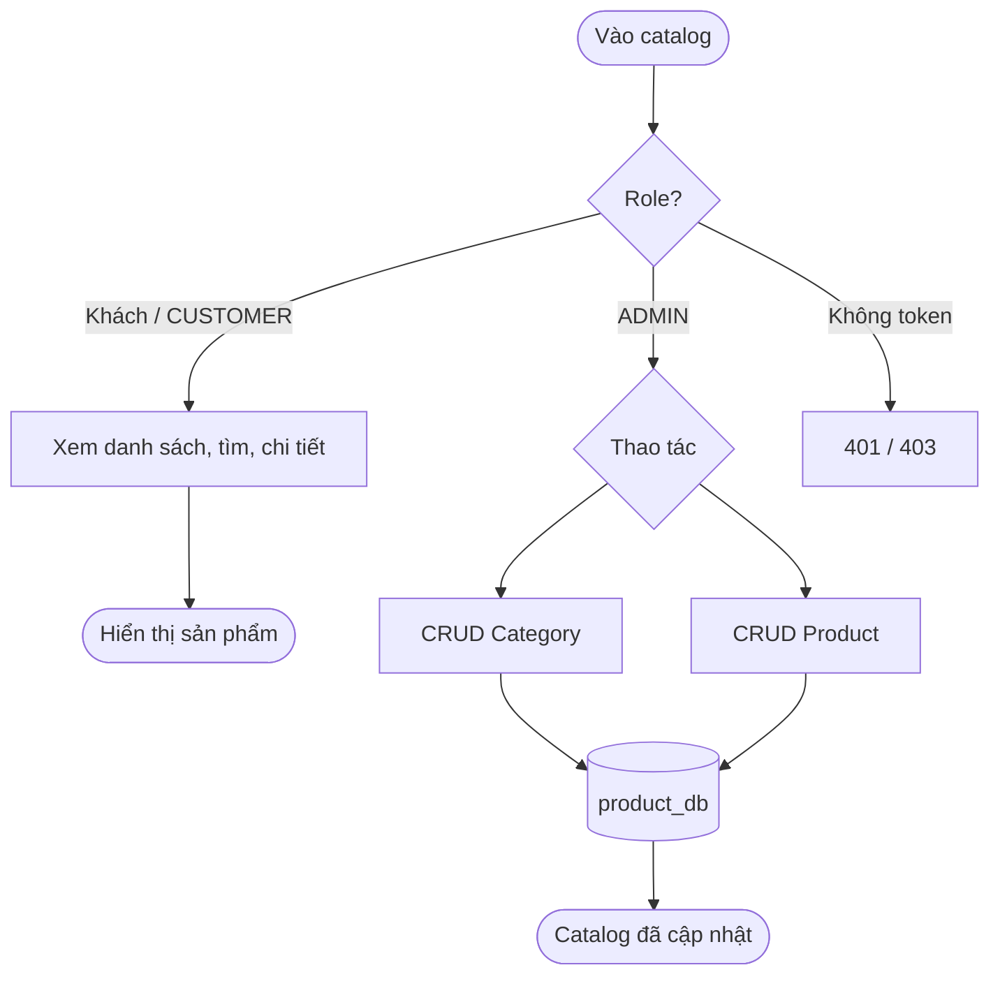

## 3.3 BPMN-03 — Giỏ hàng

Mỗi customer một giỏ. `userId` lấy từ JWT, không tin client tự gửi.

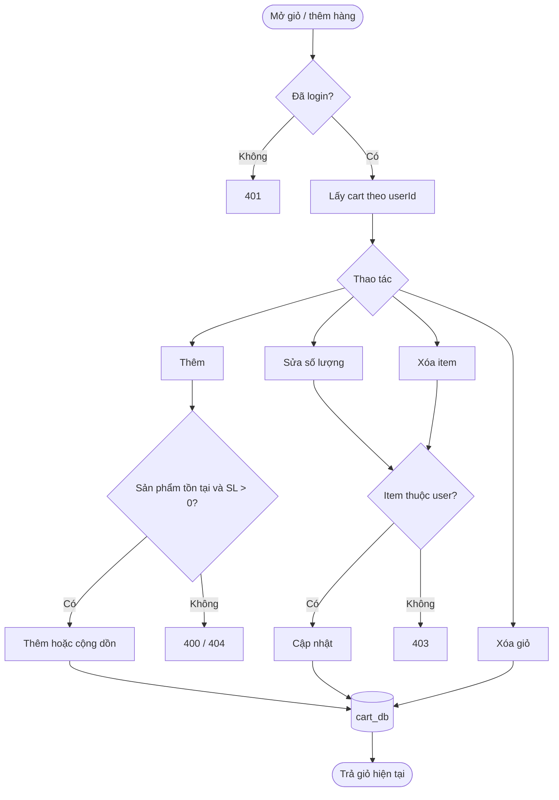

## 3.4 BPMN-04 — Checkout (quy trình quan trọng nhất)

Customer → Cart → Order → Inventory → Payment → Order → Notification.

Nhánh thất bại: Payment FAILED → Release Inventory → Order `PAYMENT_FAILED`.

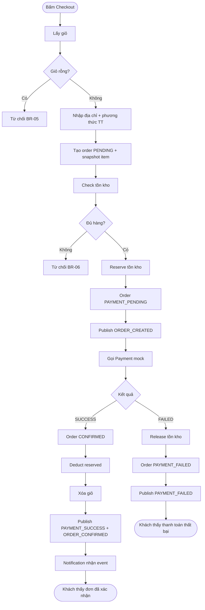

**Compensation (Saga):** Payment fail không dùng transaction phân tán. Order Service gọi Inventory **release**, rồi đánh dấu đơn thất bại.

## 3.5 BPMN-05 — Thanh toán (mock)

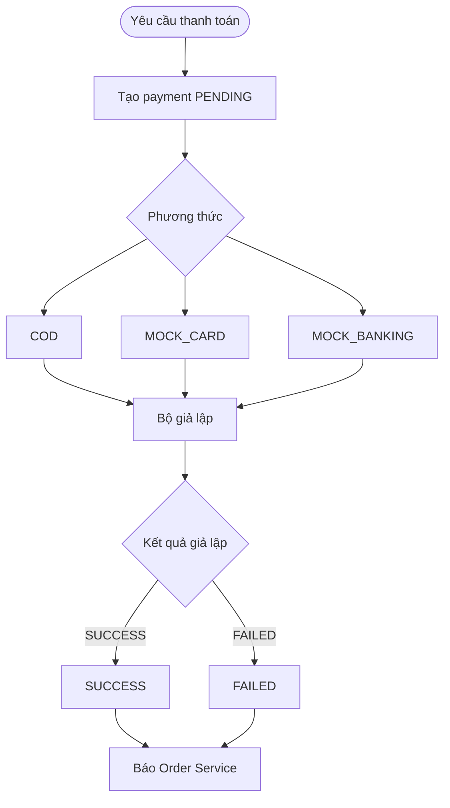

## 3.6 BPMN-06 — Xử lý / giao hàng

Admin chuyển: CONFIRMED → PROCESSING → SHIPPING → DELIVERED.  
Customer chỉ hủy khi PENDING / PAYMENT_PENDING.

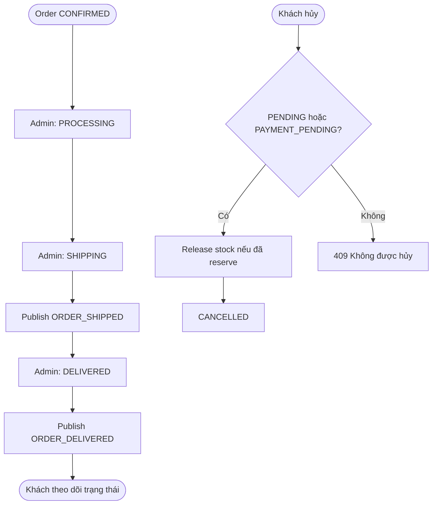

---

# Câu 4 — Biểu đồ tiêu biểu

Dùng các sơ đồ này khi thuyết trình (chiếu hoặc in).

## 4.1 System Context — hệ thống nhìn từ bên ngoài

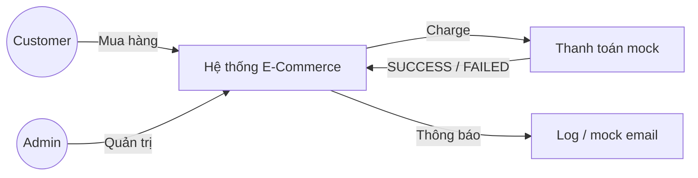

**Nói khi bảo vệ:** hai người dùng chính; thanh toán và email là giả lập.

## 4.2 Use Case

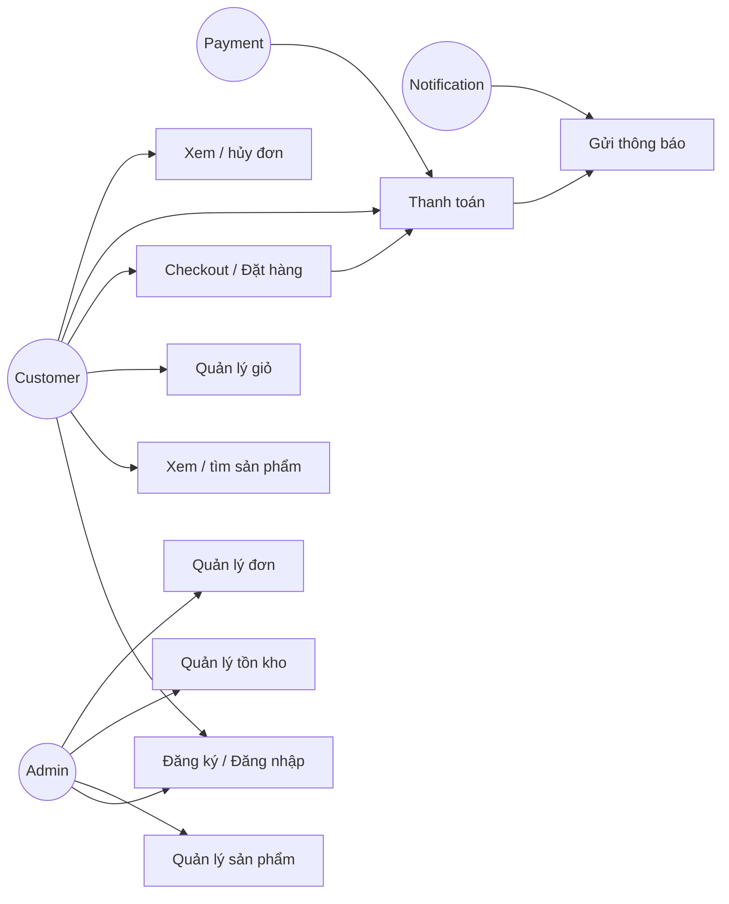

## 4.3 Kiến trúc tổng thể

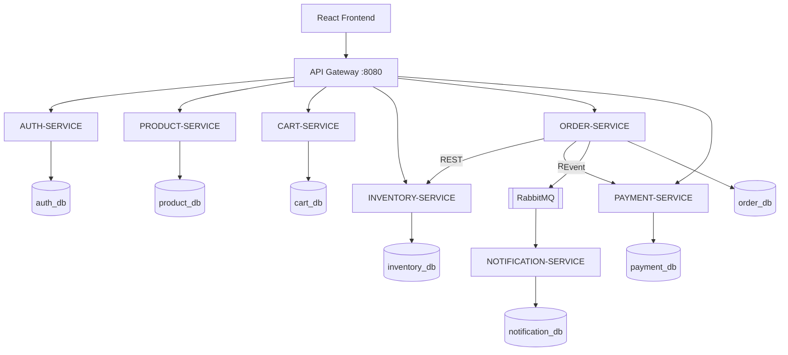

Frontend **chỉ gọi Gateway**. Không gọi thẳng từng service.

## 4.4 Deployment

Máy dev:

- Frontend Vite `:5173`
- Gateway `:8080`, Eureka `:8761`
- Bảy business service `:8081`–`:8087`
- PostgreSQL local `:5432`
- RabbitMQ Docker `:5672` / UI `:15672`

## 4.5 Sequence — Đăng nhập

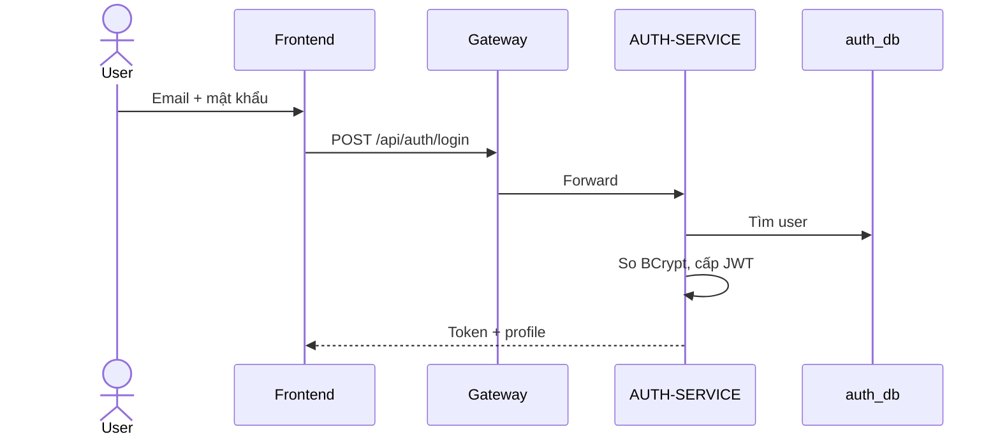

## 4.6 Sequence — Checkout + Saga

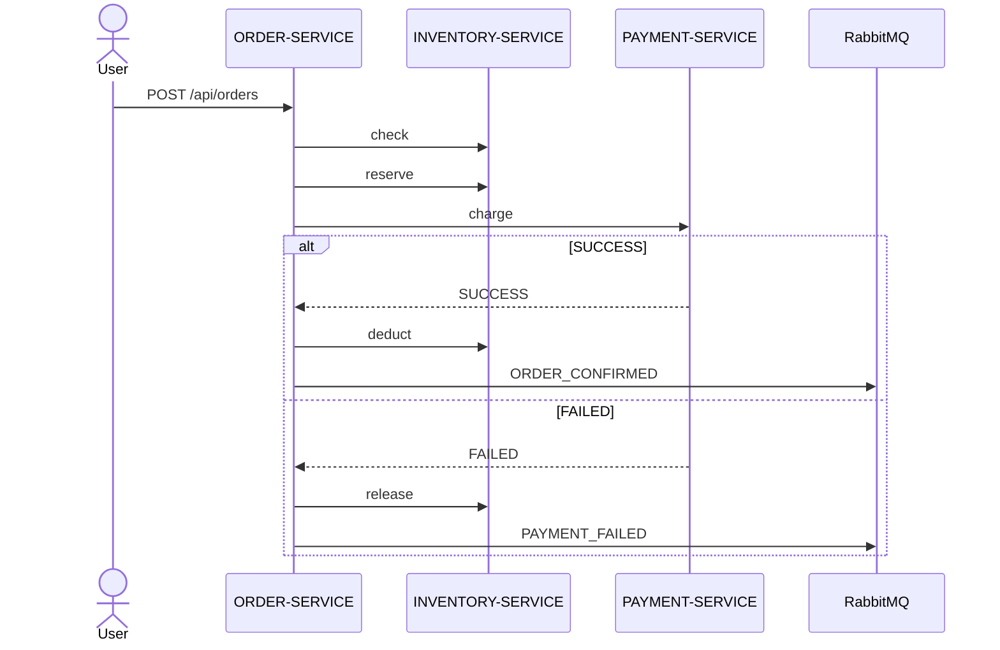

**Câu hỏi hay gặp:** “Sao không dùng một transaction cho cả ba database?”  
**Trả lời:** Mỗi service một DB, không 2PC. Dùng Saga: bước sau fail thì bù (release stock).

## 4.7 Sequence — Notification

Order publish event → RabbitMQ → Notification lưu / log. Order **đã commit** trước đó. Consumer lỗi chỉ ghi log.

## 4.8 ERD logic (không phải một database chung)

Bảy cụm độc lập. Chỉ `product_db` và `order_db` / `cart_db` có FK **nội bộ**. Không có FK `orders.user_id → users.id`.

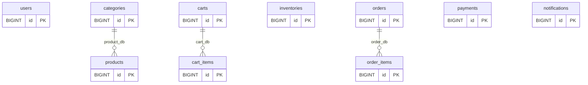

---

# Phần 2 — Kiến trúc Microservices

Mục này trả lời: **chọn gì, tại sao, khái niệm, đặc điểm, ưu/nhược, thành phần, hoạt động thế nào.**

## 2.1 Lựa chọn nội dung

Đồ án chọn **Microservices Architecture** (không chọn Data Warehouse, không chọn monolith).

So sánh nhanh:

| | Modular Monolith | Microservices (chọn) |
|--|------------------|----------------------|
| Deploy | Một ứng dụng | Nhiều service |
| Database | Thường một DB | Database per service |
| Giao tiếp | Gọi hàm | REST + message |
| Phù hợp đề bài Spring Cloud | Khó demo Gateway / Eureka / MQ | Đúng yêu cầu |
| Độ khó | Thấp | Trung bình — kiểm soát bằng phạm vi hẹp |

Không chọn Data Warehouse vì bài toán là **giao dịch mua hàng realtime**, không phải phân tích dữ liệu lớn / ETL.

## 2.2 Tại sao chọn Microservices

1. Đề tài yêu cầu Spring Boot + Spring Cloud.
2. Các miền (auth, catalog, giỏ, kho, đơn, thanh toán, thông báo) có dữ liệu và vòng đời khác nhau.
3. Cần vừa gọi **đồng bộ** (Order → Inventory → Payment) vừa **bất đồng bộ** (Order → RabbitMQ → Notification).
4. Dễ giải thích khi bảo vệ: ranh giới service, Saga, eventual consistency.
5. Có thể scale từng phần (ví dụ Product đọc nhiều hơn Payment) — hướng mở rộng, không bắt buộc demo nhiều instance.

## 2.3 Khái niệm

**Microservices** là cách chia một hệ thống lớn thành nhiều dịch vụ nhỏ, mỗi dịch vụ:

- làm **một bounded context**;
- deploy độc lập;
- sở hữu dữ liệu riêng;
- giao tiếp qua mạng (API / message), không share database.

**Khái niệm kèm theo trong đồ án**

| Thuật ngữ | Nghĩa trong đồ án |
|-----------|-------------------|
| Bounded context | Một miền nghiệp vụ (Auth, Product, Order, …) |
| API Gateway | Cổng vào duy nhất cho frontend |
| Service Discovery | Eureka: service tự đăng ký, Gateway tìm bằng tên |
| Database per service | Mỗi service một logical DB |
| Saga | Chuỗi bước + bù trừ, thay cho 2PC |
| Eventual consistency | Notification / event có thể đến sau Order |

## 2.4 Đặc điểm — ưu và nhược

**Đặc điểm áp dụng**

- Service stateless (trừ DB).
- Frontend không biết topology nội bộ.
- Inventory là nguồn sự thật về tồn kho; Product không lưu stock.
- Payment là mock.
- Notification tách khỏi transaction Order.

**Ưu**

- Ranh giới rõ, dễ phân công và bảo vệ.
- Lỗi notification không kéo sập checkout.
- Có thể thay Payment sau này mà ít đụng Catalog.

**Nhược**

- Phức tạp hơn monolith: nhiều process, nhiều DB.
- Không join SQL xuyên service.
- Cần Saga / bù trừ khi thanh toán fail.
- Dev phải chạy nhiều service.

**Cách đồ án giảm nhược điểm**

Một PostgreSQL chứa 7 logical DB (vẫn đúng ownership). Payment mock. Không thêm công nghệ không cần thiết.

## 2.5 Thành phần

### Service nghiệp vụ

| Service | Port | DB | Việc chính |
|---------|------|----|------------|
| auth-service | 8081 | auth_db | Đăng ký, login, JWT, user |
| product-service | 8082 | product_db | Sản phẩm, danh mục, tìm kiếm |
| cart-service | 8083 | cart_db | Giỏ hàng |
| inventory-service | 8084 | inventory_db | Check / reserve / release / deduct |
| order-service | 8085 | order_db | Đơn hàng + **orchestrator Saga** |
| payment-service | 8086 | payment_db | Thanh toán giả lập |
| notification-service | 8087 | notification_db | Consumer RabbitMQ |

### Hạ tầng

| Thành phần | Vai trò |
|------------|---------|
| API Gateway `:8080` | Routing `/api/**`, CORS |
| Eureka `:8761` | Đăng ký / tìm service |
| PostgreSQL `:5432` | Lưu dữ liệu (user `postgres`) |
| RabbitMQ `:5672` | Event đơn hàng / thanh toán |
| Frontend React | Giao diện Customer + Admin |
| Docker Compose | Chạy RabbitMQ (Postgres dùng máy local) |

### Thành phần trong mỗi service

```
Controller → Service → Repository → Database
```

DTO ra vào API. Entity không đưa thẳng ra client. Có exception handler thống nhất.

## 2.6 Hoạt động như thế nào?

### Bước 1 — Client vào hệ thống

Trình duyệt → React → `http://localhost:8080/api/...` → Gateway → đúng service.

### Bước 2 — Xác thực

Login thành công → JWT. Các API giỏ / đơn / admin gửi `Authorization: Bearer <token>`. Gateway / service kiểm tra role.

### Bước 3 — Mua hàng (đồng bộ)

1. Customer thêm hàng vào Cart Service.
2. Checkout gọi Order Service.
3. Order gọi Inventory (REST): check rồi reserve.
4. Order gọi Payment (REST): mock charge.
5. Thành công: confirm + deduct. Thất bại: release + `PAYMENT_FAILED`.

### Bước 4 — Thông báo (bất đồng bộ)

Order publish message. Notification nhận sau, lưu DB, log. Chậm hoặc lỗi vẫn **không** hủy đơn đã confirm.

### Bước 5 — Admin fulfillment

Admin đổi PROCESSING / SHIPPING / DELIVERED. Event giao hàng tiếp tục sang Notification.

```
SYNC:   Gateway → Service
        Order → Inventory
        Order → Payment

ASYNC:  Order → RabbitMQ → Notification
```

## 2.7 Công nghệ

| Tầng | Công nghệ |
|------|-----------|
| Backend | Java 21, Spring Boot 3.4, Spring Cloud 2024, Spring Security, JPA |
| Gateway / Discovery | Spring Cloud Gateway, Eureka |
| DB | PostgreSQL 17 — `localhost:5432`, user `postgres` |
| Message | RabbitMQ |
| Frontend | React, Vite, React Router, Axios |
| Test | JUnit 5, Postman |

Mật khẩu DB lấy từ biến môi trường `DB_PASSWORD` (môi trường local: `123456`). Không hard-code secret production.

---

# Thiết kế dữ liệu và API

## Cơ sở dữ liệu

Một instance PostgreSQL, **bảy logical database**. Không FK xuyên service.

| Database | Bảng |
|----------|------|
| auth_db | users |
| product_db | categories, products |
| cart_db | carts, cart_items |
| inventory_db | inventories |
| order_db | orders, order_items |
| payment_db | payments |
| notification_db | notifications |

`inventories`: `available_quantity`, `reserved_quantity` — không âm.  
`order_items`: snapshot `product_name`, `unit_price`, `subtotal`.

## API chính (qua Gateway)

| Nhóm | Method + path |
|------|----------------|
| Auth | `POST /api/auth/register`, `POST /api/auth/login`, `GET /api/auth/profile` |
| Product | `GET/POST/PUT/DELETE /api/products` |
| Cart | `GET /api/cart`, `POST/PUT/DELETE /api/cart/items` |
| Order | `POST/GET /api/orders`, `POST /api/orders/{id}/cancel` |
| Admin order | `GET /api/admin/orders`, `PATCH /api/admin/orders/{id}/status` |
| Payment | `POST /api/payments`, `GET /api/payments/{id}` |
| Inventory nội bộ | `POST /internal/inventory/check\|reserve\|release\|deduct` |

Response thống nhất:

```json
{ "success": true, "message": "Success", "data": {} }
```

Lỗi: `success: false`, `code`, `message`, `timestamp`.

---

# Kịch bản demo

*(Dùng khi cuối kỳ demo chương trình — sau khi Phase 2/3 code xong.)*

## Demo thành công (~5 phút)

1. Admin login (`admin@example.com`) → tạo / xem sản phẩm.
2. Customer login (`customer@example.com`) → xem sản phẩm.
3. Thêm giỏ → Checkout.
4. Tồn kho được reserve.
5. Payment SUCCESS → Order CONFIRMED.
6. Xem RabbitMQ / bảng `notifications`.
7. Customer xem chi tiết đơn.

## Demo thất bại (~2 phút)

1. Checkout với cờ giả lập payment fail.
2. Stock được **trả lại**.
3. Order = `PAYMENT_FAILED`.

## Hiện trạng triển khai

Phase 1 đã có: phân tích, BPMN, kiến trúc, thiết kế DB/API, skeleton build được, 7 database đã tạo trên PostgreSQL.  
Nghiệp vụ runtime (JWT, CRUD, Saga chạy thật) thuộc các phase sau — **không khai trong báo cáo như đã chạy** cho đến khi code xong.

---

# Phân chia công việc

Áp dụng nếu làm nhóm. Nếu làm một mình thì một người đảm nhận toàn bộ.

| STT | Hạng mục | Người thực hiện | Trạng thái |
|-----|----------|-----------------|------------|
| 1 | Phân tích nghiệp vụ, FR/NFR, use case | Trần Văn Hải | Đã xong (Phase 1) |
| 2 | BPMN + biểu đồ | Trần Văn Hải | Đã xong (Phase 1) |
| 3 | Kiến trúc microservices, ADR | Trần Văn Hải | Đã xong (Phase 1) |
| 4 | Thiết kế DB + API | Trần Văn Hải | Đã xong (Phase 1) |
| 5 | Skeleton backend / frontend | Trần Văn Hải | Đã xong (Phase 1) |
| 6 | Backend nghiệp vụ + Saga + JWT | Trần Văn Hải | Phase 2 |
| 7 | Frontend + demo E2E | Trần Văn Hải | Phase 3 |
| 8 | Test, Docker, hoàn thiện báo cáo in | Trần Văn Hải | Phase 4 |

---

# Kết luận

Đồ án xây **hệ thống e-commerce một cửa hàng** theo **Microservices** để giải quyết mua hàng online, không oversell, thanh toán fail có bù tồn kho, và thông báo không phá đơn.

Hai tác nhân chính là **Customer** và **Admin**, kèm Payment mock và Notification.

Quy trình then chốt là **Checkout BPMN**: Order điều phối Inventory và Payment (Saga).

Kiến trúc gồm Gateway, Eureka, bảy service nghiệp vụ, PostgreSQL database-per-service, RabbitMQ.

Tài liệu này đủ để **thuyết trình Phần phân tích – thiết kế**. Phần demo chương trình hoàn chỉnh bổ sung khi backend và frontend được triển khai.

---

## Phụ lục — Câu hỏi bảo vệ ngắn

| Câu hỏi | Trả lời gọn |
|---------|-------------|
| Microservices khác monolith chỗ nào? | Nhiều service, nhiều DB, giao tiếp mạng; monolith một app một DB. |
| Vì sao không FK `order.user_id → users.id`? | Hai database khác nhau; chỉ lưu ID. |
| Oversell xử lý ra sao? | Reserve trước pay; không cho `available < 0`. |
| Payment fail thì sao? | Release stock, order `PAYMENT_FAILED`. |
| Notification lỗi có mất đơn không? | Không. Event sau transaction. |
| Frontend gọi service nào? | Chỉ Gateway. |
| Thanh toán có thật không? | Không. Mock để demo hai nhánh. |
| Saga là gì? | Orchestration tại Order: tạo → reserve → pay → confirm hoặc bù. |

---

*Hết báo cáo (bản dùng để in / thuyết trình). Chi tiết kỹ thuật bổ sung nằm trong thư mục `docs/`.*
