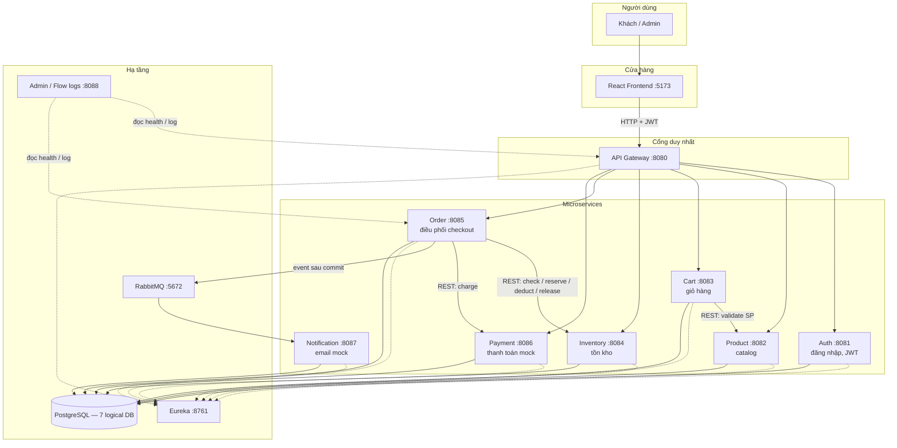
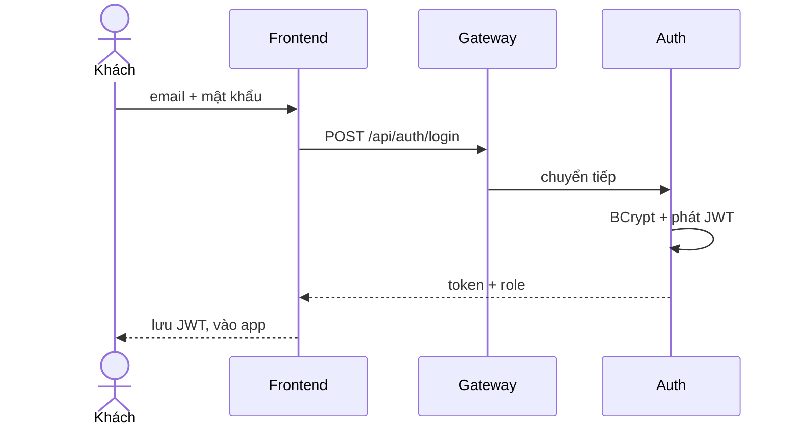
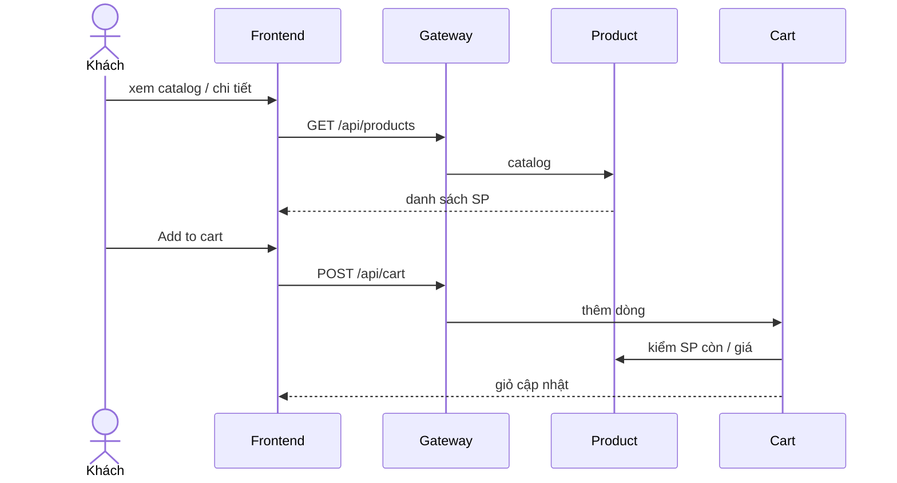
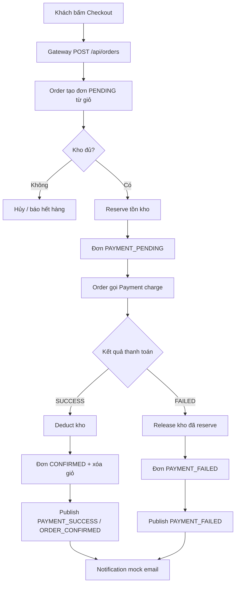

# GTVT E-Commerce

Cửa hàng trực tuyến (Spring Boot 3 + Spring Cloud + React). Khách chỉ nói chuyện với **một cửa**: API Gateway `:8080`. Các microservice phía sau tự chia việc — mỗi service một database, Order điều phối checkout, Notification nhận sự kiện qua RabbitMQ.

Chi tiết kỹ thuật: `docs/06-architecture.md`.  
Luồng chạy Spring Cloud + map config (SA): `docs/15-spring-cloud-luong-chay-va-config.md`.  
Deploy: `docs/12-deployment.md`.

## Hệ thống hoạt động như thế nào

1. **Browser không gọi từng service.** React (`:5173`) chỉ gọi Gateway. Gateway route `/api/auth`, `/api/products`, `/api/cart`, `/api/orders`, …
2. **Mỗi miền một service + một DB.** Auth không đọc `order_db`; Order không ghi `product_db`. Giao tiếp bằng REST (OpenFeign) hoặc event, không share bảng.
3. **Checkout là Saga do Order cầm.** Order lần lượt: lấy giỏ → kiểm/giữ kho → thanh toán mock. Thành công thì trừ kho + xóa giỏ; thất bại thì nhả kho.
4. **Email không nằm trong giao dịch đặt hàng.** Order publish event lên RabbitMQ; Notification consume rồi ghi log.
5. **Eureka** để service đăng ký. **Admin `:8088/flow`** để xem log từng bước theo `cid`.

## Sơ đồ tổng quan



**Đọc sơ đồ:** mũi tên liền = request đồng bộ (chờ trả lời). Mũi tên nét đứt tới Eureka = đăng ký / discovery. Order → RabbitMQ = bất đồng bộ (checkout đã xong mới gửi mail).

## Flow nghiệp vụ

### 1. Đăng nhập



Mọi API sau đó gửi `Authorization: Bearer <JWT>`. Role `CUSTOMER` mua hàng; `ADMIN` quản lý catalog / kho / đơn.

### 2. Xem sản phẩm và thêm giỏ



### 3. Checkout — hai nhánh

Order Service là **orchestrator**. Payment là mock: mặc định SUCCESS; tick “Simulate payment failure” trên UI để đi nhánh thất bại.



| | Golden Path | Failure Path |
|---|---|---|
| UI | Checkout, **không** tick fail | Tick **Simulate payment failure** |
| Đơn | `CONFIRMED` | `PAYMENT_FAILED` |
| Kho | `available` giảm (deduct) | `available` trở lại (release) |
| Mail | log success | log payment failed |

Notification **không rollback** đơn: event gửi sau khi Order đã commit.

## Services

| Service | Port | Database | Việc chính |
|---------|------|----------|------------|
| postgres | 5432 | 7 logical DB | Dữ liệu (volume `postgres-data`) |
| rabbitmq | 5672 / 15672 | — | Event Order → Notification |
| eureka-server | 8761 | — | Service discovery |
| admin-server | 8088 | — | Spring Boot Admin + UI `/flow` |
| gateway | 8080 | — | Entry point, CORS, route `/api/**` |
| auth-service | 8081 | auth_db | Login, JWT, user/role |
| product-service | 8082 | product_db | Catalog |
| cart-service | 8083 | cart_db | Giỏ theo user |
| inventory-service | 8084 | inventory_db | Check / reserve / deduct / release |
| order-service | 8085 | order_db | Tạo đơn, cầm Saga |
| payment-service | 8086 | payment_db | Charge mock SUCCESS/FAILED |
| notification-service | 8087 | notification_db | Consume RabbitMQ |
| frontend | 5173 | — | Storefront (nginx → Gateway `/api`) |

## Deploy

Cần **Docker Desktop**. Tắt PostgreSQL Windows nếu chiếm `:5432`.

```bat
powershell -ExecutionPolicy Bypass -File scripts\deploy.ps1
```

Maven package **một lần** (volume `gtvt-ecommerce-m2`) rồi `docker compose up -d --build`. Volume Postgres/RabbitMQ giữ data; init SQL chỉ khi volume Postgres trống. Leftover container từ project Compose khác bị gỡ trước `up`.

| | |
|--|--|
| Đổi code Java | `scripts\deploy.ps1` |
| JAR đã có, chỉ rebuild image | `scripts\deploy.ps1 -SkipMaven` |
| Bật lại container, không build | `scripts\deploy.ps1 -RestartOnly` |

| | URL |
|--|-----|
| Storefront | http://localhost:5173 |
| Gateway | http://localhost:8080 |
| Eureka | http://localhost:8761 |
| Admin / flow | http://localhost:8088/flow |
| RabbitMQ UI | http://localhost:15672 (`ecommerce` / `ecommerce`) |
| Postgres | `localhost:5432` (`postgres` / `123456`) |

Tắt PostgreSQL cài trên máy nếu đang chiếm `:5432`.

Reset sạch DB: `docker compose down -v` rồi chạy lại `scripts\deploy.ps1`.

## Flow logs

**http://localhost:8088/flow** — hub (trong container Admin) gọi `/actuator/logfile` qua DNS Compose (`http://gateway:8080`, `http://auth:8081`, …), không dùng `localhost`. Tự refresh 3s. Tìm `cid` hoặc `start checkout`.

Spring Boot Admin: **http://localhost:8088**

Log container: `docker compose logs -f order` (đổi tên service trong `docker-compose.yml`).

## Environment

Copy `.env.example` nếu cần đổi JWT / DB / RabbitMQ. Không commit `.env`. Compose đọc biến này khi `up`.

## Test

Stack đã lên: `powershell -File scripts\e2e-verify.ps1` (gọi Gateway `:8080`).

## Swagger

Từng service (không qua Gateway): `http://localhost:8081/swagger-ui.html` … `:8087`. Spec: `/v3/api-docs`.

## Demo accounts

- admin@example.com / Password123
- customer@example.com / Password123
- customer2@example.com / Password123

Kịch bản Golden Path / Failure Path: `docs/13-demo.md`.  
Postman: `postman/ecommerce.postman_collection.json` (`baseUrl` `http://localhost:8080`).

## Troubleshooting

- **Port 5432 in use:** dừng PostgreSQL Windows, chạy lại `scripts\deploy.ps1`.
- **Container name Conflict:** chạy `scripts\deploy.ps1` (gỡ leftover từ project khác, ví dụ folder `e-commerce`). Không dùng `docker compose down -v` trừ khi muốn xóa DB.
- **Gateway 401:** login lại, gửi `Authorization: Bearer`.
- **Catalog trống:** đợi product-service seeder; hoặc `docker compose down -v` rồi deploy lại.
- **Inventory not found:** admin PUT `/api/inventory/{productId}`.
