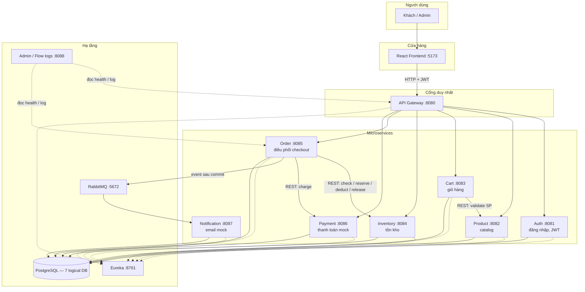
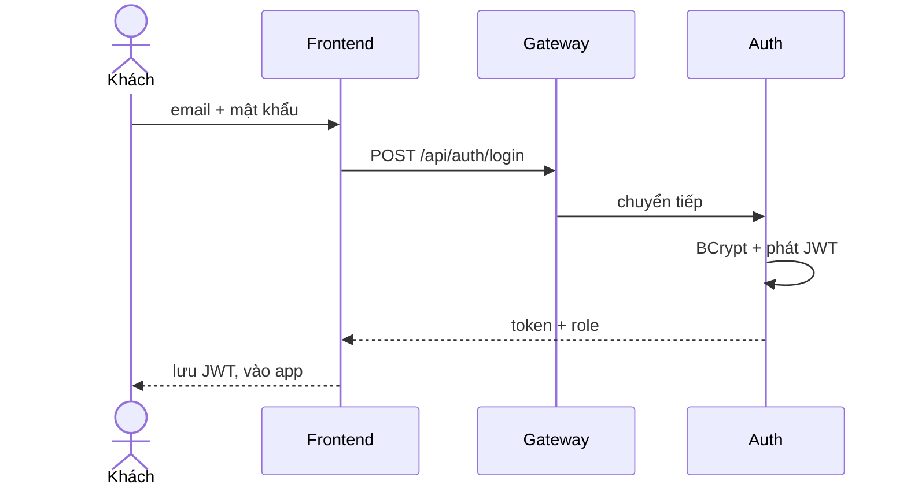
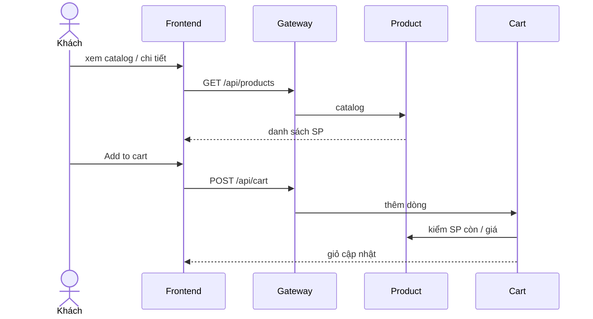
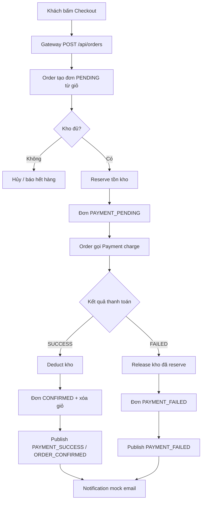

# GTVT E-Commerce

Cửa hàng trực tuyến (Spring Boot 3 + Spring Cloud + React). Khách chỉ nói chuyện với **một cửa**: API Gateway `:8080`. Các microservice phía sau tự chia việc — mỗi service một database, Order điều phối checkout, Notification nhận sự kiện qua RabbitMQ.

Chi tiết kỹ thuật: `docs/06-architecture.md`.

## Hệ thống hoạt động như thế nào

1. **Browser không gọi từng service.** React (`:5173`) chỉ gọi Gateway. Gateway route `/api/auth`, `/api/products`, `/api/cart`, `/api/orders`, …
2. **Mỗi miền một service + một DB.** Auth không đọc `order_db`; Order không ghi `product_db`. Giao tiếp bằng REST (OpenFeign) hoặc event, không share bảng.
3. **Checkout là Saga do Order cầm.** Order lần lượt: lấy giỏ → kiểm/giữ kho → thanh toán mock. Thành công thì trừ kho + xóa giỏ; thất bại thì nhả kho.
4. **Email không nằm trong giao dịch đặt hàng.** Order publish event lên RabbitMQ; Notification consume rồi ghi log `[MOCK EMAIL]`.
5. **Eureka** để service tìm nhau. **Admin `:8088/flow`** để xem log từng bước theo `cid`.

## Sơ đồ tổng quan



**Đọc sơ đồ:** mũi tên liền = request đồng bộ (chờ trả lời). Mũi tên nét đứt tới Eureka = đăng ký / discovery. Order → RabbitMQ = bất đồng bộ (checkout đã xong mới gửi mail).

## Flow nghiệp vụ

### 1. Đăng nhập



Mọi API sau đó gửi `Authorization: Bearer <JWT>`. Role `CUSTOMER` mua hàng; `ADMIN` quản lý catalog / kho / đơn.

### 2. Xem sản phẩm và thêm giỏ



### 3. Checkout — hai nhánh

Order Service là **orchestrator**. Payment là mock: mặc định SUCCESS; tick “Simulate payment failure” trên UI để đi nhánh thất bại.



| | Golden Path | Failure Path |
|---|---|---|
| UI | Checkout, **không** tick fail | Tick **Simulate payment failure** |
| Đơn | `CONFIRMED` | `PAYMENT_FAILED` |
| Kho | `available` giảm (deduct) | `available` trở lại (release) |
| Mail | log success | log payment failed |

Notification **không rollback** đơn: event gửi sau khi Order đã commit.

## Services

| Service | Port | Database | Việc chính |
|---------|------|----------|------------|
| eureka-server | 8761 | — | Service discovery |
| admin-server | 8088 | — | Spring Boot Admin + UI `/flow` |
| gateway | 8080 | — | Entry point, CORS, route `/api/**` |
| auth-service | 8081 | auth_db | Login, JWT, user/role |
| product-service | 8082 | product_db | Catalog |
| cart-service | 8083 | cart_db | Giỏ theo user |
| inventory-service | 8084 | inventory_db | Check / reserve / deduct / release |
| order-service | 8085 | order_db | Tạo đơn, cầm Saga |
| payment-service | 8086 | payment_db | Charge mock SUCCESS/FAILED |
| notification-service | 8087 | notification_db | Consume RabbitMQ, mock email |
| frontend | 5173 | — | Storefront chính |
| frontend-bicycle | 5174 | — | VOLTRA e-bike storefront |

## Requirements

- JDK 21 (`C:\Program Files\Microsoft\jdk-21.0.12.101-hotspot`)
- Maven 3.9
- Node 22 / npm
- PostgreSQL 17 `localhost:5432` `postgres` / `123456`
- Docker (RabbitMQ; optional full compose)

## Installation / Run

Lần đầu (tạo DB, tạo container RabbitMQ, cài frontend):

```bat
powershell -ExecutionPolicy Bypass -File scripts\init-postgres.ps1
docker compose up -d rabbitmq
powershell -ExecutionPolicy Bypass -File scripts\start-local.ps1
cd frontend
npm install
npm run dev
```

Open http://localhost:5173

## Chạy lại (lần sau)

Không chạy lại `init-postgres` / `docker compose up` / `npm install`. Container `ecommerce-rabbitmq` đã tồn tại — `compose up` sẽ báo **Conflict**. Chỉ start lại:

```bat
docker start ecommerce-rabbitmq
powershell -ExecutionPolicy Bypass -File scripts\start-local.ps1
cd frontend
npm run dev
```

Nếu RabbitMQ chưa có (máy mới / đã `docker rm`): dùng lại `docker compose up -d rabbitmq`.

## Xem flow logs

Mở **http://localhost:8088/flow** — hub gom log `start` / bước / `end` / `HTTP` của Gateway và mọi service (tự refresh 3s).

Spring Boot Admin (instances, logfile đầy đủ): **http://localhost:8088**

1. Restart backend (RabbitMQ đã chạy hoặc vừa `docker start`):

```bat
powershell -ExecutionPolicy Bypass -File scripts\start-local.ps1
```

2. Gọi API qua Gateway `http://localhost:8080` (login, xem sản phẩm, checkout…).

3. Xem trên `/flow`, hoặc file `logs/*.log`, hoặc:

```bat
powershell -File scripts\watch-logs.ps1
powershell -File scripts\watch-logs.ps1 -Service ORDER-SERVICE
```

Tìm theo `cid` (8 ký tự) hoặc chữ `start checkout` / `end checkout`.

## Environment

Copy `.env.example`. JWT, DB, RabbitMQ via env. Do not commit `.env`.

## Test

```bat
set JAVA_HOME=C:\Program Files\Microsoft\jdk-21.0.12.101-hotspot
mvn test
powershell -File scripts\e2e-verify.ps1
```

## Swagger

`http://localhost:8081/swagger-ui.html` (auth) and similarly 8082–8087.

## Demo accounts

- admin@example.com / Password123
- customer@example.com / Password123
- customer2@example.com / Password123

## Demo scenario

`docs/13-demo.md` — Golden Path (payment success + stock deduct) and Failure Path (PAYMENT_FAILED + release).

## Postman

`postman/ecommerce.postman_collection.json` — baseUrl `http://localhost:8080`.

## Troubleshooting

- Java 8 on PATH: set JAVA_HOME to JDK 21.
- Gateway 401: login again, paste Bearer token.
- Empty catalog: wait for product-service seeder; use fresh product_db.
- RabbitMQ connection: `docker start ecommerce-rabbitmq` (lần sau). Lần đầu hoặc đã xóa container: `docker compose up -d rabbitmq`.
- RabbitMQ name conflict (`/ecommerce-rabbitmq` already in use): `docker start ecommerce-rabbitmq` — không `compose up` lại.
- Inventory not found: admin PUT `/api/inventory/{productId}`.
