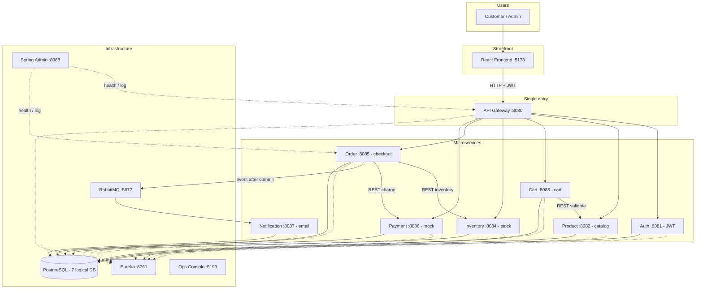
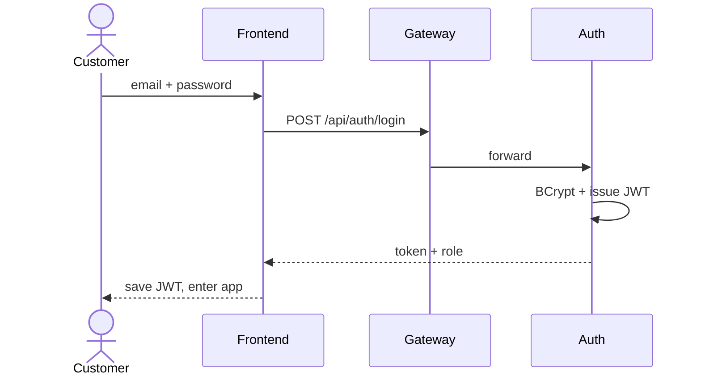
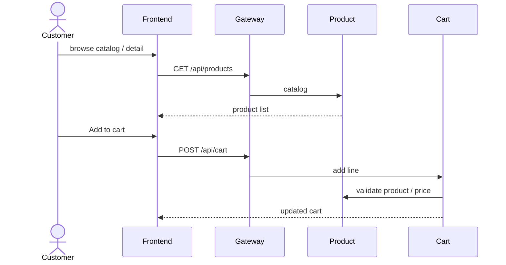
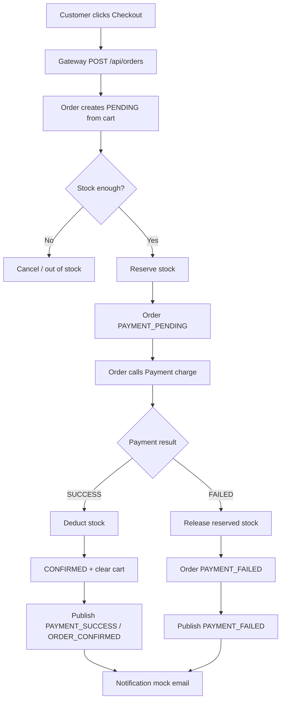

# GTVT E-Commerce

Cửa hàng trực tuyến (Spring Boot 3 + Spring Cloud + React). Khách chỉ nói chuyện với **một cửa**: API Gateway `:8080`. Các microservice phía sau tự chia việc — mỗi service một database, Order điều phối checkout, Notification nhận sự kiện qua RabbitMQ.

Chi tiết kỹ thuật: `docs/06-architecture.md`.  
Luồng chạy Spring Cloud + map config (SA): `docs/15-spring-cloud-luong-chay-va-config.md`.  
Deploy: `docs/12-deployment.md`.

## Hệ thống hoạt động như thế nào

1. **Browser không gọi từng service.** React (`:5173`) chỉ gọi Gateway. Gateway route `/api/auth`, `/api/products`, `/api/cart`, `/api/orders`, …
2. **Mỗi miền một service + một DB.** Auth không đọc `order_db`; Order không ghi `product_db`. Giao tiếp bằng REST (OpenFeign) hoặc event, không share bảng.
3. **Checkout là Saga do Order cầm.** Order lần lượt: lấy giỏ → kiểm/giữ kho → thanh toán mock. Thành công thì trừ kho + xóa giỏ; thất bại thì nhả kho.
4. **Email không nằm trong giao dịch đặt hàng.** Order publish event lên RabbitMQ; Notification consume rồi ghi log.
5. **Eureka** để service đăng ký. **Ops Console `:5199`** để xem status/log và deploy/restart service. Spring Boot Admin `:8088`.

## Sơ đồ tổng quan



**Đọc sơ đồ:** mũi tên liền = request đồng bộ (chờ trả lời). Mũi tên nét đứt tới Eureka = đăng ký / discovery. Order → RabbitMQ = bất đồng bộ (checkout đã xong mới gửi mail). Nhãn trong diagram dùng ASCII để tránh lỗi font Mermaid trên một số Markdown previewer.

## Flow nghiệp vụ

### 1. Đăng nhập



Mọi API sau đó gửi `Authorization: Bearer <JWT>`. Role `CUSTOMER` mua hàng; `ADMIN` quản lý catalog / kho / đơn.

### 2. Xem sản phẩm và thêm giỏ



### 3. Checkout — hai nhánh

Order Service là **orchestrator**. Payment là mock: mặc định SUCCESS; tick “Simulate payment failure” trên UI để đi nhánh thất bại.



| | Golden Path | Failure Path |
|---|---|---|
| UI | Checkout, **không** tick fail | Tick **Simulate payment failure** |
| Đơn | `CONFIRMED` | `PAYMENT_FAILED` |
| Kho | `available` giảm (deduct) | `available` trở lại (release) |
| Mail | log success | log payment failed |

Notification **không rollback** đơn: event gửi sau khi Order đã commit.

## Services

| Service | Port | Database | Việc chính |
|---------|------|----------|------------|
| postgres | 5432 | 7 logical DB | Dữ liệu (volume `postgres-data`) |
| rabbitmq | 5672 / 15672 | — | Event Order → Notification |
| eureka-server | 8761 | — | Service discovery |
| admin-server | 8088 | — | Spring Boot Admin |
| gateway | 8080 | — | Entry point, CORS, route `/api/**` |
| auth-service | 8081 | auth_db | Login, JWT, user/role |
| product-service | 8082 | product_db | Catalog |
| cart-service | 8083 | cart_db | Giỏ theo user |
| inventory-service | 8084 | inventory_db | Check / reserve / deduct / release |
| order-service | 8085 | order_db | Tạo đơn, cầm Saga |
| payment-service | 8086 | payment_db | Charge mock SUCCESS/FAILED |
| notification-service | 8087 | notification_db | Consume RabbitMQ |
| frontend | 5173 | — | Storefront (nginx → Gateway `/api`) |
| ops-control-plane | 8099 | — | Ops API (status / logs / deploy jobs) |
| ops-console | 5199 | — | Ops UI quản lý stack |

## Chạy local (Docker Compose)

Cần **Docker Desktop** đang chạy. Trên macOS/Linux, giải phóng cổng **5432** nếu Postgres local đang chiếm. Trên Windows, tắt PostgreSQL Windows nếu chiếm **5432**.

### 1. Lên toàn bộ stack

Trong thư mục gốc repo (`GTVT_ecommerce/`):

**macOS / Linux** (engine: `scripts/ops-deploy.sh`)

```bash
chmod +x scripts/ops-deploy.sh scripts/deploy.sh
./scripts/ops-deploy.sh full
# hoặc: ./scripts/deploy.sh
```

**Windows** (cần bash / Git Bash)

```bat
powershell -ExecutionPolicy Bypass -File scripts\deploy.ps1
```

Lệnh `full`:

1. Lock một job deploy (`scripts/.ops-deploy.lock`).
2. Gỡ container trùng tên nếu thuộc project Compose **khác**.
3. Build JAR trong container Maven (`mvn -DskipTests package`, cache `gtvt-ecommerce-m2`).
4. `docker compose up -d --build` — infra, microservices, Gateway, Frontend, Ops API/UI.

Deploy từng service (an toàn khi đang chạy):

```bash
./scripts/ops-deploy.sh restart --service auth
./scripts/ops-deploy.sh rebuild --service auth
./scripts/ops-deploy.sh maven-rebuild --service order
```

Lần đầu mất vài phút (kéo image + Maven). Lần sau cùng lệnh: data Postgres/RabbitMQ **giữ nguyên** (volume). Init DB (`docker/init-postgres.sql`) chỉ chạy khi volume Postgres còn trống.

Tương đương từng bước (nếu không dùng script):

```bash
docker compose up -d --build
```

(Cần JAR trong `*/target/*-SNAPSHOT.jar` trước — script đã lo bước Maven.)

Đợi container `healthy` / `started`: `docker compose ps`

### 2. Mở ứng dụng

| | URL | Tài khoản |
|--|-----|-----------|
| Storefront | http://localhost:5173 | customer@example.com / Password123 |
| Gateway API | http://localhost:8080 | Bearer JWT sau login |
| Ops Console | http://localhost:5199 | admin / abc123 |
| Ops API | http://localhost:8099 | ops / ops |
| Spring Boot Admin | http://localhost:8088 | admin / admin |
| Eureka | http://localhost:8761 | — |
| RabbitMQ UI | http://localhost:15672 | ecommerce / ecommerce |
| Postgres | localhost:5432 | postgres / 123456 |
| Swagger (từng service) | http://localhost:8081/swagger-ui.html … `:8087` | — |

Admin UI storefront: admin@example.com / Password123. User phụ: customer2@example.com / Password123.

### 3. Lệnh hàng ngày

| Việc | macOS / Linux | Windows |
|------|---------------|---------|
| Đổi code Java / pom (full) | `./scripts/ops-deploy.sh full` | `scripts\deploy.ps1` |
| JAR đã build, rebuild images | `./scripts/ops-deploy.sh full --skip-maven` | `deploy.ps1 -SkipMaven` |
| Chỉ restart containers | `./scripts/ops-deploy.sh full --restart-only` | `deploy.ps1 -RestartOnly` |
| Restart 1 service | `./scripts/ops-deploy.sh restart --service auth` | bash cùng lệnh |
| Rebuild 1 service | `./scripts/ops-deploy.sh rebuild --service auth` | bash cùng lệnh |
| Maven + rebuild 1 service | `./scripts/ops-deploy.sh maven-rebuild --service order` | bash cùng lệnh |
| Xem log / status / deploy UI | http://localhost:5199 | giống |
| Trạng thái CLI | `docker compose ps` | giống |
| Dừng stack (giữ DB) | `docker compose stop` | giống |
| Xóa container, **giữ** volume DB | `docker compose down` | giống |
| Xóa sạch DB + RabbitMQ data | `docker compose down -v` rồi `./scripts/ops-deploy.sh full` | tương tự |

Health Gateway: `GET http://localhost:8080/actuator/health`  
E2E (Windows): `powershell -File scripts\e2e-verify.ps1`

### 4. Cấu hình

Copy `.env.example` → `.env` nếu đổi mật khẩu DB / JWT / RabbitMQ. Không commit `.env`. Compose đọc file này khi `up`.

Mạng nội bộ: Feign và Admin dùng hostname Compose (`postgres`, `rabbitmq`, `eureka`, `auth`, `gateway`, `admin`, …).

Chi tiết kỹ thuật: `docs/12-deployment.md`. Demo checkout: `docs/13-demo.md`. Postman: `postman/ecommerce.postman_collection.json` (`baseUrl` `http://localhost:8080`).

### 5. Lỗi thường gặp

| Hiện tượng | Cách xử lý |
|------------|------------|
| Port 5432 already allocated | Dừng Postgres local / PostgreSQL Windows, chạy lại `ops-deploy.sh full` |
| Conflict container name | `ops-deploy.sh` gỡ leftover project khác. Không `down -v` trừ khi muốn xóa DB |
| Ops deploy “Another job is running” | Đợi job xong hoặc xóa lock `scripts/.ops-deploy.lock` nếu process chết |
| Log `localhost:8088` Connection refused | Image service cũ — rebuild để Admin client trỏ `http://admin:8088` |
| Gateway 401 | Login lại, header `Authorization: Bearer` |
| Catalog trống | Đợi seeder product; hoặc `docker compose down -v` rồi deploy lại |
| Inventory not found | Admin PUT `/api/inventory/{productId}` |
