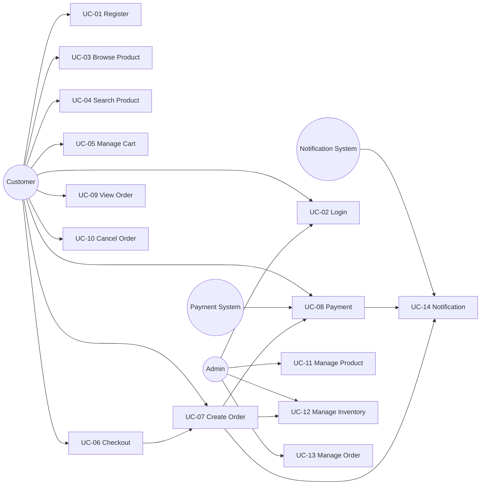

# Chương 4 — Use Cases

## 4.1 Use Case List

| ID | Name | Primary Actor | FR |
|----|------|---------------|----|
| UC-01 | Register | Customer | FR-01 |
| UC-02 | Login | Customer, Admin | FR-02 |
| UC-03 | Browse Product | Customer | FR-03, FR-05 |
| UC-04 | Search Product | Customer | FR-04 |
| UC-05 | Manage Cart | Customer | FR-06 |
| UC-06 | Checkout | Customer | FR-07 |
| UC-07 | Create Order | Customer | FR-08 |
| UC-08 | Payment | Customer, Payment System | FR-09 |
| UC-09 | View Order | Customer | FR-10, FR-12 |
| UC-10 | Cancel Order | Customer | FR-11 |
| UC-11 | Manage Product | Admin | FR-13, FR-14 |
| UC-12 | Manage Inventory | Admin / Order Service | FR-15 |
| UC-13 | Manage Order | Admin | FR-16 |
| UC-14 | Notification | Notification System | FR-17 |

## 4.2 Use Case Diagram

File diagram độc lập: xem thêm `docs/diagrams/architecture.mmd` cho kiến trúc; use case được giữ trong tài liệu này để khớp đặc tả.

---

## 4.3 Use Case Specifications

### UC-01 Register

| Field | Content |
|-------|---------|
| ID | UC-01 |
| Name | Register |
| Actor | ACTOR-01 Customer |
| Description | Người dùng tạo tài khoản mới bằng email và mật khẩu. |
| Preconditions | Email chưa tồn tại. |
| Trigger | Người dùng gửi form đăng ký. |
| Main Flow | 1. User nhập email, password, fullName. 2. Auth Service validate. 3. Kiểm tra email unique. 4. Hash password (BCrypt). 5. Lưu user role CUSTOMER. 6. Trả thông tin user (không password). |
| Alternative Flow | A1. User đã login — chuyển về trang chủ. |
| Exception Flow | E1. Email trùng — 409 EMAIL_ALREADY_EXISTS. E2. Validation fail — 400 / 422. |
| Postcondition | User được tạo, có thể login. |
| Business Rules | BR-01, BR-02 |

### UC-02 Login

| Field | Content |
|-------|---------|
| ID | UC-02 |
| Name | Login |
| Actor | Customer, Admin |
| Description | Xác thực và cấp JWT. |
| Preconditions | Tài khoản đã tồn tại. |
| Trigger | User gửi email + password. |
| Main Flow | 1. Validate input. 2. Tìm user theo email. 3. So khớp BCrypt. 4. Phát JWT (sub, role, exp). 5. Trả token + profile. |
| Alternative Flow | A1. Admin login — cùng API, role ADMIN. |
| Exception Flow | E1. Sai email/password — 401 INVALID_CREDENTIALS. E2. User inactive — 403. |
| Postcondition | Client lưu JWT, gọi API có Authorization header. |
| Business Rules | BR-02 |

### UC-03 Browse Product

| Field | Content |
|-------|---------|
| ID | UC-03 |
| Name | Browse Product |
| Actor | Customer (Admin cũng đọc được) |
| Description | Xem danh sách và chi tiết sản phẩm. |
| Preconditions | Không bắt buộc login để xem catalog (public read). |
| Trigger | Mở trang Home / Product List / Product Detail. |
| Main Flow | 1. GET /api/products?page&size. 2. Product Service trả danh sách ACTIVE. 3. User chọn sản phẩm. 4. GET /api/products/{id}. |
| Alternative Flow | A1. Lọc theo category trên list. |
| Exception Flow | E1. Product không tồn tại — 404 PRODUCT_NOT_FOUND. |
| Postcondition | User xem được thông tin sản phẩm. |
| Business Rules | BR-03 (read allowed) |

### UC-04 Search Product

| Field | Content |
|-------|---------|
| ID | UC-04 |
| Name | Search Product |
| Actor | Customer |
| Description | Tìm kiếm và lọc sản phẩm. |
| Preconditions | Có dữ liệu catalog. |
| Trigger | User nhập từ khóa hoặc chọn bộ lọc. |
| Main Flow | 1. Gửi keyword, categoryId, brand, minPrice, maxPrice, page, size. 2. Product Service query. 3. Trả kết quả phân trang. |
| Alternative Flow | A1. Không có kết quả — empty list, không lỗi. |
| Exception Flow | E1. Tham số không hợp lệ — 400. |
| Postcondition | User nhận danh sách khớp tiêu chí. |
| Business Rules | — |

### UC-05 Manage Cart

| Field | Content |
|-------|---------|
| ID | UC-05 |
| Name | Manage Cart |
| Actor | Customer |
| Description | Thêm / sửa / xóa item trong giỏ của chính mình. |
| Preconditions | Customer đã login (JWT). |
| Trigger | Add to cart hoặc thao tác trên trang Cart. |
| Main Flow | 1. Xác thực JWT, lấy userId. 2. Lấy hoặc tạo cart. 3. Add / update quantity / remove / clear. 4. Trả cart hiện tại. |
| Alternative Flow | A1. Add sản phẩm đã có — cộng dồn quantity. |
| Exception Flow | E1. Chưa login — 401. E2. Cart item không thuộc user — 403/404. E3. Quantity <= 0 — 400. E4. Product không tồn tại — 404. |
| Postcondition | Cart phản ánh đúng lựa chọn của user. |
| Business Rules | BR-04 |

### UC-06 Checkout

| Field | Content |
|-------|---------|
| ID | UC-06 |
| Name | Checkout |
| Actor | Customer |
| Description | Khởi tạo đặt hàng từ giỏ: địa chỉ giao hàng + phương thức thanh toán. |
| Preconditions | Customer đã login. Cart có ít nhất 1 item. |
| Trigger | User nhấn Checkout / Place Order. |
| Main Flow | 1. Lấy cart theo userId. 2. Kiểm tra cart không rỗng. 3. Thu thập shipping info + payment method. 4. Gọi UC-07 Create Order. 5. Gọi UC-08 Payment. 6. Hiển thị kết quả. |
| Alternative Flow | — |
| Exception Flow | E1. Cart rỗng — 400 CART_EMPTY (BR-05). E2. Tồn kho không đủ — dừng, không confirm. E3. Payment fail — xem UC-08. |
| Postcondition | Order được tạo (success hoặc PAYMENT_FAILED). Cart có thể được clear khi order confirmed. |
| Business Rules | BR-05, BR-06, BR-07, BR-08, BR-09 |

### UC-07 Create Order

| Field | Content |
|-------|---------|
| ID | UC-07 |
| Name | Create Order |
| Actor | Customer (qua Order Service) |
| Description | Tạo order và reserve inventory. |
| Preconditions | Checkout hợp lệ. |
| Trigger | Order Service nhận yêu cầu tạo đơn. |
| Main Flow | 1. Tạo order PENDING với order items snapshot (tên, giá, SL, subtotal). 2. Check inventory. 3. Reserve inventory. 4. Chuyển PAYMENT_PENDING. 5. Publish ORDER_CREATED (best-effort). 6. Chờ payment. |
| Alternative Flow | — |
| Exception Flow | E1. Check/reserve fail — không tạo đơn thành công / đánh dấu thất bại, không oversell. |
| Postcondition | Order tồn tại; stock đã reserve nếu reserve thành công. |
| Business Rules | BR-06, BR-07, BR-10 |

### UC-08 Payment

| Field | Content |
|-------|---------|
| ID | UC-08 |
| Name | Payment |
| Actor | Customer, ACTOR-03 Payment System |
| Description | Thanh toán mock cho order. |
| Preconditions | Order ở PAYMENT_PENDING, stock đã reserve. |
| Trigger | Order Service gọi Payment Service, hoặc customer gọi POST /api/payments. |
| Main Flow | 1. Tạo payment PENDING. 2. Mock processor trả SUCCESS. 3. Payment SUCCESS. 4. Order CONFIRMED. 5. Deduct reserved stock. 6. Publish PAYMENT_SUCCESS, ORDER_CONFIRMED. 7. Clear cart. |
| Alternative Flow | A1. COD — vẫn ghi nhận payment method COD; với đồ án này COD có thể coi là SUCCESS giả lập khi mock cho phép. |
| Exception Flow | E1. Mock FAILED — payment FAILED, release inventory, order PAYMENT_FAILED, publish PAYMENT_FAILED. |
| Postcondition | Payment record tồn tại; order và inventory nhất quán với kết quả. |
| Business Rules | BR-08, BR-09, BR-12 |

### UC-09 View Order

| Field | Content |
|-------|---------|
| ID | UC-09 |
| Name | View Order |
| Actor | Customer |
| Description | Xem danh sách và chi tiết đơn của mình. |
| Preconditions | Đã login. |
| Trigger | Mở Order List / Order Detail. |
| Main Flow | 1. GET /api/orders theo userId trong JWT. 2. GET /api/orders/{id} nếu thuộc về user. |
| Alternative Flow | A1. Chưa có đơn — empty list. |
| Exception Flow | E1. Order người khác — 403. E2. Không tìm thấy — 404. |
| Postcondition | User thấy trạng thái và item snapshot. |
| Business Rules | BR-04 |

### UC-10 Cancel Order

| Field | Content |
|-------|---------|
| ID | UC-10 |
| Name | Cancel Order |
| Actor | Customer |
| Description | Hủy đơn ở trạng thái hợp lệ. |
| Preconditions | Order thuộc về user. Status ∈ {PENDING, PAYMENT_PENDING}. |
| Trigger | User nhấn Cancel. |
| Main Flow | 1. Kiểm tra ownership. 2. Kiểm tra status hợp lệ. 3. Release reserved stock nếu có. 4. Status = CANCELLED. 5. Publish event nếu cần. |
| Alternative Flow | — |
| Exception Flow | E1. Status CONFIRMED/PROCESSING/SHIPPING/DELIVERED — 409 ORDER_NOT_CANCELLABLE. E2. Không phải chủ đơn — 403. |
| Postcondition | Order CANCELLED; stock được trả nếu đã reserve. |
| Business Rules | BR-11, BR-04, BR-09 |

### UC-11 Manage Product

| Field | Content |
|-------|---------|
| ID | UC-11 |
| Name | Manage Product |
| Actor | Admin |
| Description | CRUD product và category. |
| Preconditions | Admin đã login. |
| Trigger | Admin thao tác trên Product / Category Management. |
| Main Flow | 1. Tạo/sửa/xóa category. 2. Tạo/sửa/xóa product (name, description, price, categoryId, brand, imageUrl, status). 3. Customer chỉ thấy product ACTIVE. |
| Alternative Flow | A1. Soft delete bằng status INACTIVE thay vì xóa cứng (tùy implement Phase 2). |
| Exception Flow | E1. Customer gọi POST/PUT/DELETE — 403. E2. Product not found — 404. |
| Postcondition | Catalog được cập nhật. |
| Business Rules | BR-03 |

### UC-12 Manage Inventory

| Field | Content |
|-------|---------|
| ID | UC-12 |
| Name | Manage Inventory |
| Actor | Admin (UI); Order Service (internal API) |
| Description | Quản lý tồn kho và các thao tác check/reserve/release/deduct. |
| Preconditions | Product tồn tại (tham chiếu bằng productId, không FK cross-db). |
| Trigger | Admin cập nhật stock, hoặc Order Service gọi internal API. |
| Main Flow | 1. Check: available >= requested. 2. Reserve: available -= qty, reserved += qty. 3. Deduct: reserved -= qty (sau payment success). 4. Release: reserved -= qty, available += qty. |
| Alternative Flow | A1. Admin tăng/giảm availableQuantity thủ công. |
| Exception Flow | E1. Không đủ hàng — 409 INSUFFICIENT_STOCK. E2. available sẽ < 0 — từ chối (BR-07). |
| Postcondition | Tồn kho nhất quán; không âm. |
| Business Rules | BR-06, BR-07 |

### UC-13 Manage Order

| Field | Content |
|-------|---------|
| ID | UC-13 |
| Name | Manage Order |
| Actor | Admin |
| Description | Xem mọi đơn và cập nhật trạng thái fulfillment. |
| Preconditions | Admin đã login. |
| Trigger | Mở Order Management. |
| Main Flow | 1. GET /api/admin/orders. 2. PATCH status: CONFIRMED → PROCESSING → SHIPPING → DELIVERED. 3. Publish ORDER_SHIPPED / ORDER_DELIVERED khi phù hợp. |
| Alternative Flow | — |
| Exception Flow | E1. Chuyển trạng thái không hợp lệ — 409. E2. Customer gọi admin API — 403. |
| Postcondition | Trạng thái đơn phản ánh tiến trình giao hàng. |
| Business Rules | BR-11 |

### UC-14 Notification

| Field | Content |
|-------|---------|
| ID | UC-14 |
| Name | Notification |
| Actor | ACTOR-04 Notification System |
| Description | Nhận event từ RabbitMQ và lưu/log thông báo. |
| Preconditions | RabbitMQ đang chạy; consumer đã subscribe. |
| Trigger | Order / Payment publish event. |
| Main Flow | 1. Consume message. 2. Map event type. 3. Lưu notifications. 4. Log console / mock email. |
| Alternative Flow | — |
| Exception Flow | E1. Lỗi persist/log — log error, **không** yêu cầu Order rollback. |
| Postcondition | Notification được ghi nhận (hoặc lỗi được log). Order không bị ảnh hưởng. |
| Business Rules | BR-12 |

---

## 4.4 Use Case ↔ Service

| Use Case | Services |
|----------|----------|
| UC-01, UC-02 | Auth Service, Gateway |
| UC-03, UC-04, UC-11 | Product Service |
| UC-05 | Cart Service, Product Service (validate product) |
| UC-06, UC-07, UC-10 | Order Service, Cart Service, Inventory Service |
| UC-08 | Payment Service, Order Service, Inventory Service |
| UC-09, UC-13 | Order Service |
| UC-12 | Inventory Service |
| UC-14 | Notification Service, RabbitMQ |
