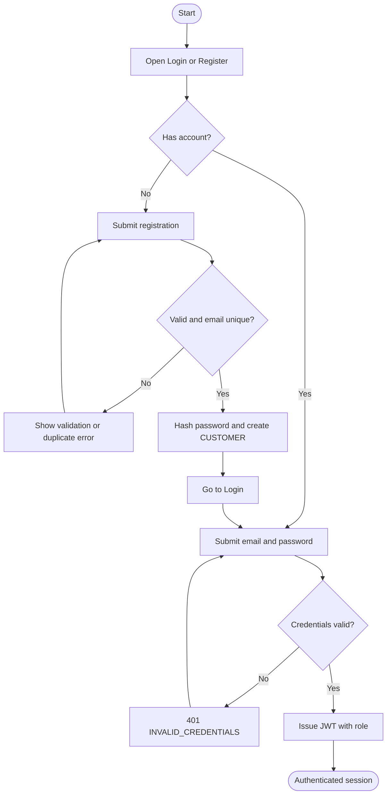
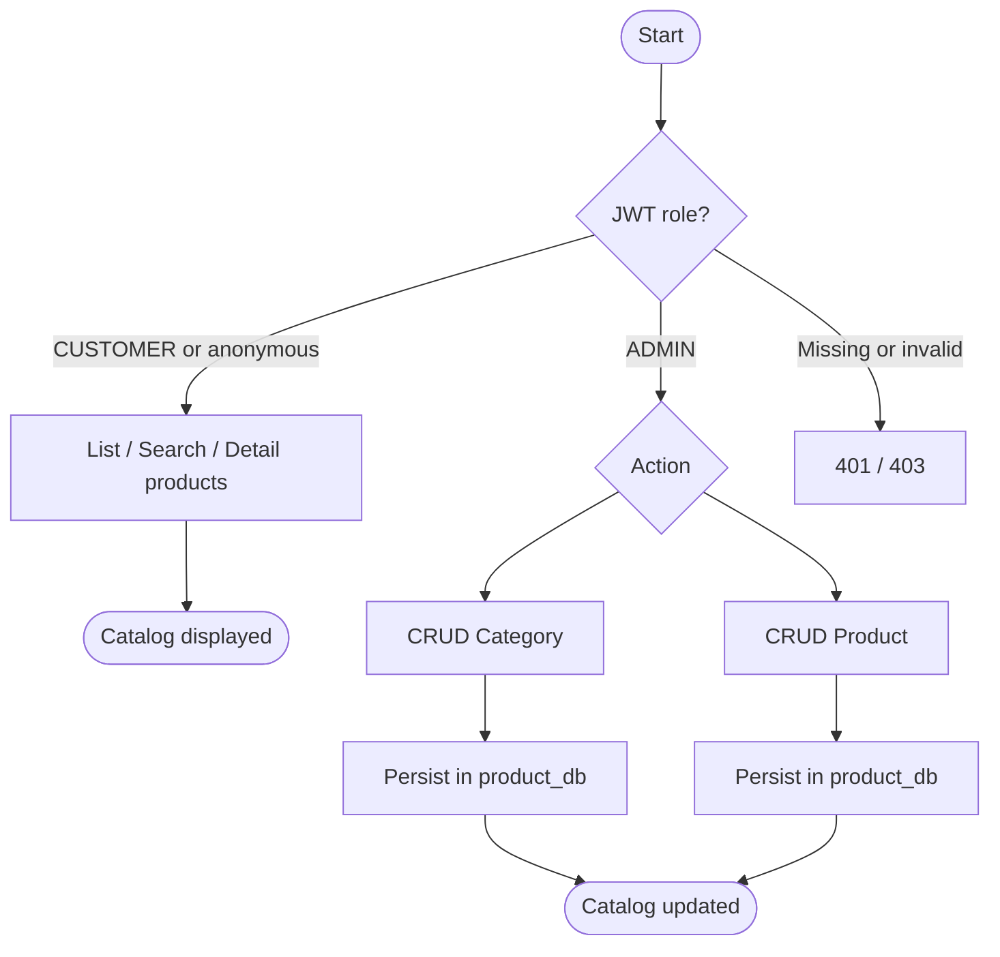
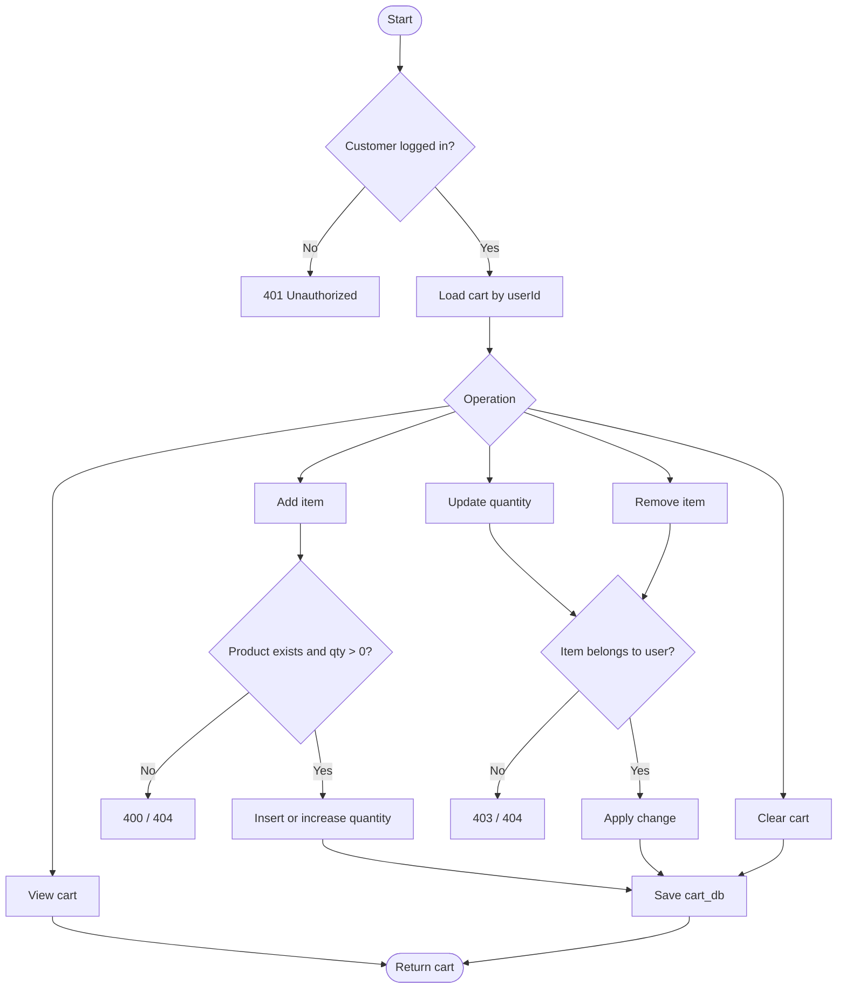
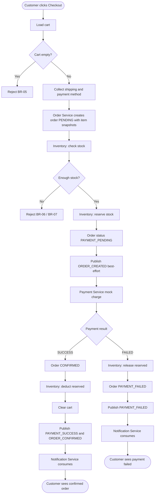
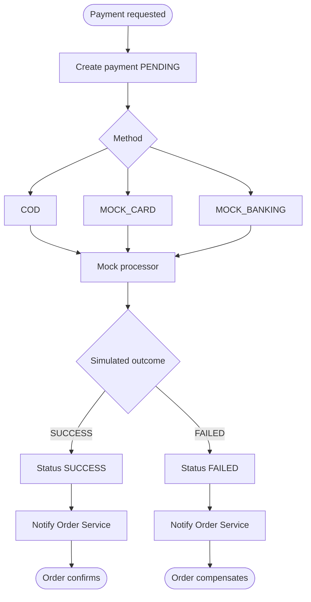
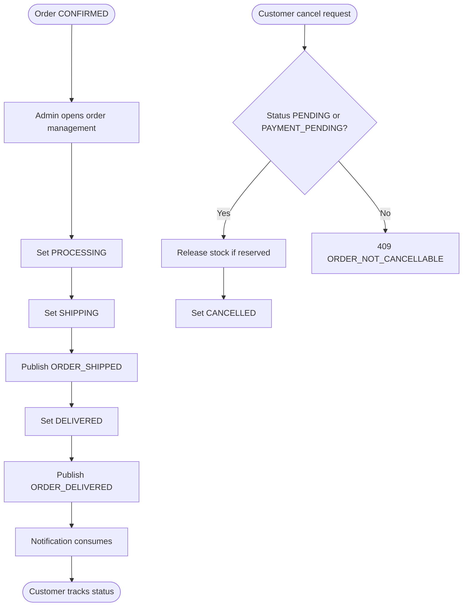

# Chương 5 — BPMN / Quy trình nghiệp vụ

Tất cả quy trình bám **Golden Path** và **Failure Path** trong `00-OVERVIEW.md` / `02-business-analysis.md`.

---

## BPMN-01 — Registration / Login

### Mục tiêu

Khách hàng hoặc admin xác thực để nhận JWT.

### Diagram



### Ghi chú

- Password không log, không trả về client.
- Role trong token: `CUSTOMER` hoặc `ADMIN`.

---

## BPMN-02 — Product Management

### Mục tiêu

Admin quản lý category và product. Customer chỉ đọc.



---

## BPMN-03 — Shopping Cart



---

## BPMN-04 — Checkout (Golden Path + Inventory + Payment)

Đây là quy trình quan trọng nhất. Phải thể hiện:

Customer → Cart → Order → Inventory → Payment → Order → Notification

và failure path: Payment Failed → Release Inventory → Order PAYMENT_FAILED.



### Compensation

```
Payment FAILED
  → Release Inventory
  → Order = PAYMENT_FAILED
```

Notification lỗi **không** rollback order (BR-12).

---

## BPMN-05 — Payment



Không tích hợp cổng thanh toán thật.

---

## BPMN-06 — Order Fulfillment



---

## Ánh xạ BPMN → Use Case / FR

| BPMN | Use Cases | FR |
|------|-----------|----|
| BPMN-01 | UC-01, UC-02 | FR-01, FR-02 |
| BPMN-02 | UC-03, UC-04, UC-11 | FR-03, FR-04, FR-05, FR-13, FR-14 |
| BPMN-03 | UC-05 | FR-06 |
| BPMN-04 | UC-06, UC-07, UC-08, UC-14 | FR-07, FR-08, FR-09, FR-15, FR-17 |
| BPMN-05 | UC-08 | FR-09 |
| BPMN-06 | UC-09, UC-10, UC-13, UC-14 | FR-10, FR-11, FR-12, FR-16, FR-17 |
