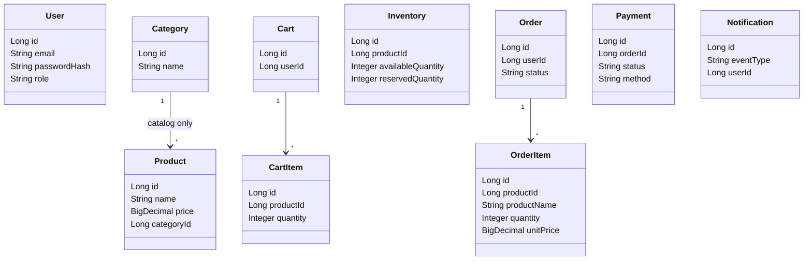

# Chương 7 — Đặc tả Microservices

Package gốc: `gtvt.haitv.ecommerce.<module>`

Ví dụ: `gtvt.haitv.ecommerce.auth`, `gtvt.haitv.ecommerce.product`.

---

## 7.1 eureka-server

| Item | Value |
|------|--------|
| Artifact | `eureka-server` |
| Eureka name | `EUREKA-SERVER` |
| Responsibility | Service registration và lookup |
| Database | Không |
| Port (dev) | 8761 |

Không chứa nghiệp vụ.

---

## 7.2 gateway

| Item | Value |
|------|--------|
| Artifact | `gateway` |
| Eureka name | `GATEWAY` |
| Responsibility | Routing, CORS, entry point, JWT filter (Phase 2) |
| Database | Không |
| Port (dev) | 8080 |

Frontend chỉ gọi Gateway, không gọi trực tiếp từng service.

---

## 7.3 auth-service

| Item | Value |
|------|--------|
| Artifact | `auth-service` |
| Eureka name | `AUTH-SERVICE` |
| Package | `gtvt.haitv.ecommerce.auth` |
| Database | `auth_db` |
| Tables | `users` |
| Port (dev) | 8081 |

Trách nhiệm: register, login, JWT, BCrypt, role, profile.

Không lưu cart/order.

---

## 7.4 product-service

| Item | Value |
|------|--------|
| Artifact | `product-service` |
| Eureka name | `PRODUCT-SERVICE` |
| Package | `gtvt.haitv.ecommerce.product` |
| Database | `product_db` |
| Tables | `categories`, `products` |
| Port (dev) | 8082 |

Trách nhiệm: product, category, search, filter, pagination.

Không lưu stock. Stock thuộc Inventory.

---

## 7.5 cart-service

| Item | Value |
|------|--------|
| Artifact | `cart-service` |
| Eureka name | `CART-SERVICE` |
| Package | `gtvt.haitv.ecommerce.cart` |
| Database | `cart_db` |
| Tables | `carts`, `cart_items` |
| Port (dev) | 8083 |

Trách nhiệm: giỏ theo `userId` (từ JWT, không tin client tự gửi userId).

Có thể gọi Product Service để xác thực productId khi add.

---

## 7.6 inventory-service

| Item | Value |
|------|--------|
| Artifact | `inventory-service` |
| Eureka name | `INVENTORY-SERVICE` |
| Package | `gtvt.haitv.ecommerce.inventory` |
| Database | `inventory_db` |
| Tables | `inventories` |
| Port (dev) | 8084 |

Trách nhiệm: available / reserved quantity; check, reserve, release, deduct.

Invariant: `availableQuantity >= 0`.

Internal API là API chính cho Order Service.

---

## 7.7 order-service

| Item | Value |
|------|--------|
| Artifact | `order-service` |
| Eureka name | `ORDER-SERVICE` |
| Package | `gtvt.haitv.ecommerce.order` |
| Database | `order_db` |
| Tables | `orders`, `order_items` |
| Port (dev) | 8085 |

Trách nhiệm: tạo đơn, lifecycle, checkout orchestration, cancel.

Order item **snapshot**: productId, productName, quantity, unitPrice, subtotal.

Gọi Inventory và Payment bằng REST/Feign. Publish event lên RabbitMQ.

---

## 7.8 payment-service

| Item | Value |
|------|--------|
| Artifact | `payment-service` |
| Eureka name | `PAYMENT-SERVICE` |
| Package | `gtvt.haitv.ecommerce.payment` |
| Database | `payment_db` |
| Tables | `payments` |
| Port (dev) | 8086 |

Mock payment. Method: COD, MOCK_CARD, MOCK_BANKING.

Status: PENDING, SUCCESS, FAILED, REFUNDED.

Cho phép điều khiển kết quả (header/flag demo) để test failure path.

---

## 7.9 notification-service

| Item | Value |
|------|--------|
| Artifact | `notification-service` |
| Eureka name | `NOTIFICATION-SERVICE` |
| Package | `gtvt.haitv.ecommerce.notification` |
| Database | `notification_db` |
| Tables | `notifications` |
| Port (dev) | 8087 |

Consumer RabbitMQ. Lưu DB + log + mock email.

Lỗi consumer không ảnh hưởng Order (BR-12).

---

## 7.10 frontend

| Item | Value |
|------|--------|
| Artifact | `frontend` |
| Stack | React, Vite, React Router, Axios |
| Port (dev) | 5173 |

Phase 1: skeleton Vite. Pages và tích hợp API thuộc Phase 3.

---

## 7.11 Sync vs Async

```
SYNC:
  Gateway → services
  Order → Inventory
  Order → Payment
  Cart → Product (optional validate)

ASYNC:
  Order → RabbitMQ → Notification
```

## 7.12 Class diagram mức service (logical)



Đây là class/entity **logic theo service**, không phải một ERD dùng chung một database.
