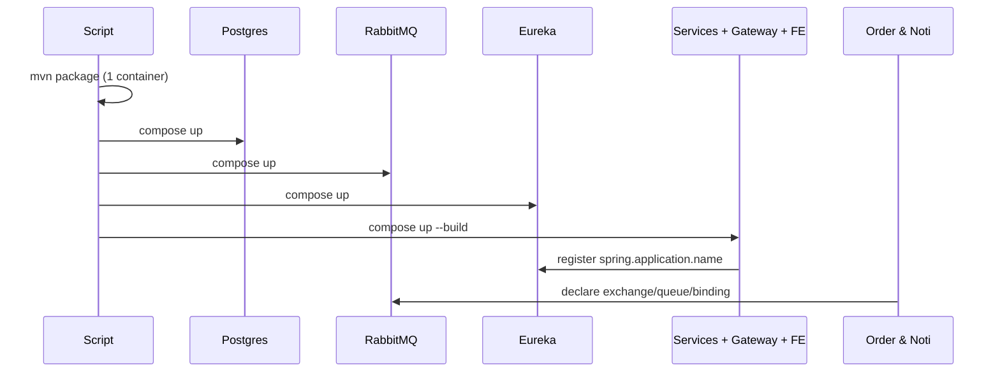
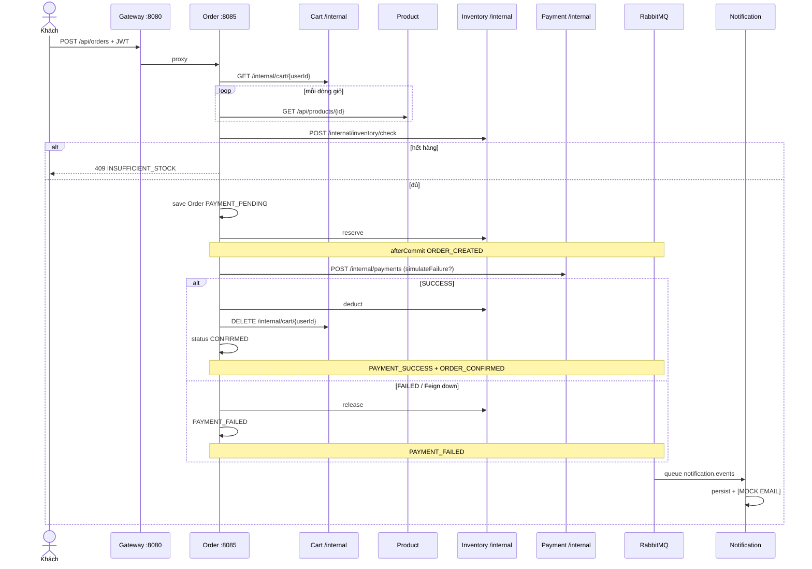

# Tài liệu SA — Luồng chạy & cấu hình Spring Cloud

**Mục đích:** giúp đọc code hiểu *request đi đâu*, *config nào quyết định hop đó*, và *Spring Cloud đóng vai trò gì* trong GTVT E-Commerce.  
**Phạm vi:** runtime hiện tại (Spring Boot 3.4.5, Spring Cloud 2024.0.1). Không mô tả “lý thuyết textbook” nếu khác với code.

Tài liệu kiến trúc tổng quát: `docs/06-architecture.md`.  
Chạy local: `README.md`, `scripts/deploy.ps1`, `docs/12-deployment.md`.

---

## 1. Cách nhìn hệ thống (SA view)

Hệ thống là **BFF + API Gateway + N microservice + 1 DB/service + messaging cho side-effect**.

| Lớp | Thành phần | Việc của lớp |
|-----|------------|--------------|
| Client | React `:5173` / `:5174` | Chỉ gọi Gateway `:8080`. Không biết port service. |
| Edge | `gateway` (Spring Cloud Gateway, WebFlux) | CORS, path routing, correlation id. **Không** validate JWT. |
| Discovery / ops | `eureka-server` `:8761`, `admin-server` `:8088` | Đăng ký instance, health, UI `/flow`. |
| Domain | auth, product, cart, inventory, order, payment, notification | Mỗi service Spring MVC + JPA + JWT (module `common`). |
| Sync hop | OpenFeign | Order/Cart gọi service khác qua HTTP nội bộ. |
| Async hop | RabbitMQ | Order publish sau commit; Notification consume. |
| Data | PostgreSQL 7 logical DB | Không share schema, không FK xuyên service. |

**Nguyên tắc đọc code:** mọi API công khai đi Gateway `/api/**`. Mọi hop Saga đi `/internal/**` (Feign, không qua Gateway). Email không nằm trong transaction checkout.

### 1.1 Spring Cloud dùng gì / không dùng gì

| Thành phần Spring Cloud | Có trong repo? | Cách dùng thực tế |
|-------------------------|----------------|-------------------|
| Spring Cloud Gateway | Có | Route **URI tĩnh** (`http://localhost:808x` hoặc env Docker). Không dùng `lb://SERVICE-NAME`. |
| Netflix Eureka Client | Có | Service đăng ký + Admin/health. Feign **không** resolve qua Eureka vì `@FeignClient(..., url = ...)`. |
| OpenFeign | Có | Cart → Product; Order → Cart/Product/Inventory/Payment. |
| Config Server / Bus | **Không** | Mỗi service `application.yml` + biến môi trường. |
| Circuit breaker / Resilience4j | **Không** | Lỗi Payment: catch `FeignException` + compensate trong Order. |
| Spring Cloud Stream | **Không** | AMQP thuần: `RabbitTemplate` + `@RabbitListener`. |

Eureka vẫn có giá trị: dashboard `:8761`, Spring Boot Admin biết instance, `healthcheck` instance. Routing runtime **không phụ thuộc** Eureka — service vẫn gọi được nếu biết URL.

---

## 2. Bootstrap thứ tự (local Docker)

`scripts/deploy.ps1`:

1. Gỡ leftover `container_name` nếu thuộc project Compose khác.
2. Maven `package` **một lần** (image `maven:3.9.9-eclipse-temurin-21`, volume `gtvt-ecommerce-m2`).
3. `docker compose up -d --build`:
   - `postgres` healthy → 7 logical DB (`docker/init-postgres.sql`, chỉ volume trống)
   - `rabbitmq` healthy
   - `eureka` → `admin` + 7 business + `gateway` + `frontend`

Compose `name: gtvt_ecommerce`. Env: `DB_HOST=postgres`, `EUREKA_URI=http://eureka:8761/eureka`, `*_SERVICE_URI=http://<service>:<port>`, Order/Notification `RABBITMQ_HOST=rabbitmq`.



---

## 3. Config theo “knob” — đọc yml như bản đồ

Pattern chung mỗi business service: `server.port`, `spring.application.name`, datasource, JPA `ddl-auto: update`, JWT, Eureka client, actuator, logging MDC `[svc] [cid]`, `clients.*.url`.

### 3.1 Identity & port

| Module | `spring.application.name` | Port mặc định | DB |
|--------|---------------------------|---------------|-----|
| eureka-server | `EUREKA-SERVER` | 8761 | — |
| admin-server | `ADMIN-SERVER` | 8088 | — |
| gateway | `GATEWAY` | 8080 | — |
| auth-service | `AUTH-SERVICE` | 8081 | `auth_db` |
| product-service | `PRODUCT-SERVICE` | 8082 | `product_db` |
| cart-service | `CART-SERVICE` | 8083 | `cart_db` |
| inventory-service | `INVENTORY-SERVICE` | 8084 | `inventory_db` |
| order-service | `ORDER-SERVICE` | 8085 | `order_db` |
| payment-service | `PAYMENT-SERVICE` | 8086 | `payment_db` |
| notification-service | `NOTIFICATION-SERVICE` | 8087 | `notification_db` |

Tên Eureka **phải khớp** `name` trên `@FeignClient` nếu sau này bỏ `url=` và dùng load balancer.

### 3.2 Biến môi trường quan trọng

| Env | Ý nghĩa | Default local |
|-----|---------|----------------|
| `SERVER_PORT` | Port HTTP | theo service |
| `DB_HOST` / `DB_PORT` / `DB_USERNAME` / `DB_PASSWORD` | JDBC | `localhost:5432` `postgres`/`123456` |
| `JWT_SECRET` / `JWT_EXPIRATION_MS` | Ký & TTL JWT — **cùng secret mọi service** | secret demo / 86400000 |
| `EUREKA_ENABLED` | Bật client | `true` |
| `EUREKA_URI` | `defaultZone` | `http://localhost:8761/eureka` |
| `AUTH_SERVICE_URI` … `NOTIFICATION_SERVICE_URI` | URI Gateway route **và** Feign `clients.*.url` | `http://localhost:808x` |
| `RABBITMQ_HOST` / `PORT` / `USERNAME` / `PASSWORD` | AMQP | `localhost:5672` `ecommerce`/`ecommerce` |
| `ADMIN_SERVER_URI` | Admin client (Gateway) | `http://localhost:8088` |

Datasource:

```text
jdbc:postgresql://${DB_HOST}:${DB_PORT}/<ten_db>
```

Mỗi service chỉ một logical DB. Hibernate tự `update` schema lúc start.

### 3.3 Eureka server

`eureka-server/.../application.yml`:

- `register-with-eureka: false`, `fetch-registry: false` — đây là registry, không tự đăng ký vào chính nó.
- `enable-self-preservation: false` + eviction 5s — môi trường lab: instance chết bị gỡ nhanh (không dùng production).

Client (mọi service + gateway):

```yaml
eureka.client.service-url.defaultZone: ${EUREKA_URI:...}
eureka.instance.prefer-ip-address: true
eureka.instance.health-check-url-path: /actuator/health
```

### 3.4 Gateway — bảng route (source of truth)

File: `gateway/src/main/resources/application.yml`.

| `id` | Predicate `Path` | `uri` env |
|------|------------------|-----------|
| auth-service | `/api/auth/**`, `/api/admin/users/**` | `AUTH_SERVICE_URI` |
| product-service | `/api/products/**` | `PRODUCT_SERVICE_URI` |
| cart-service | `/api/cart/**` | `CART_SERVICE_URI` |
| inventory-service | `/api/inventory/**` | `INVENTORY_SERVICE_URI` |
| order-service | `/api/orders/**`, `/api/admin/orders/**` | `ORDER_SERVICE_URI` |
| payment-service | `/api/payments/**` | `PAYMENT_SERVICE_URI` |
| notification-service | `/api/notifications/**` | `NOTIFICATION_SERVICE_URI` |

CORS global `/**`: origin pattern `*`, credentials `true`.

**Không** có route `/internal/**`. Feign gọi thẳng host:port service đích. Đó là đường biên bảo vệ: browser không thấy inventory check/reserve.

Filter `GatewayFlowFilter`:

- Bỏ qua `/actuator`.
- Gắn/forward header `X-Correlation-Id` (8 ký tự UUID nếu chưa có).
- Log `start` / `route id -> uri` / `end status ms`.

Gateway **không** gắn Spring Security JWT. Token đi như header bình thường tới service.

### 3.5 OpenFeign — URL cứng

Ví dụ Order:

```yaml
clients:
  product.url: ${PRODUCT_SERVICE_URI:http://localhost:8082}
  cart.url: ${CART_SERVICE_URI:http://localhost:8083}
  inventory.url: ${INVENTORY_SERVICE_URI:http://localhost:8084}
  payment.url: ${PAYMENT_SERVICE_URI:http://localhost:8086}
```

`@FeignClient(name = "INVENTORY-SERVICE", url = "${clients.inventory.url:...}")` — khi có `url`, Feign **bỏ** discovery.

`EnableFeignClients` trên `OrderServiceApplication`, `CartServiceApplication`.

`FeignCorrelationInterceptor` copy `X-Correlation-Id` từ MDC sang request Feign.

### 3.6 RabbitMQ

Khai báo trùng ở Order + Notification (`RabbitConfig`):

| Artifact | Giá trị (`OrderEvent`) |
|----------|-------------------------|
| Exchange | `ecommerce.events` (topic, durable) |
| Queue | `notification.events` (durable) |
| Routing key | `order.event` |

Publish: `RabbitTemplate.convertAndSend(EXCHANGE, ROUTING_KEY, event)` **sau commit** (`TransactionSynchronization.afterCommit`). Consume: `@RabbitListener(queues = OrderEvent.QUEUE)`.

Event types: `ORDER_CREATED`, `PAYMENT_SUCCESS`, `ORDER_CONFIRMED`, `PAYMENT_FAILED`, `ORDER_SHIPPED`, `ORDER_DELIVERED`.

Notification fail **không** rollback đơn.

### 3.7 JWT (module `common`)

```yaml
jwt:
  secret: ${JWT_SECRET:...}
  expiration-ms: ${JWT_EXPIRATION_MS:86400000}
```

- Auth: `JwtService.generateToken(userId, email, role)` — subject = userId, claims `email`, `role`.
- Mọi resource service: `JwtAuthFilter` đọc `Authorization: Bearer`, parse HS256, set `AuthenticatedUser` vào SecurityContext.
- Session `STATELESS`, CSRF off.

Public (permitAll) điển hình:

- POST `/api/auth/register`, `/api/auth/login`
- GET `/api/products/**`
- `/actuator/**`, Swagger
- `/internal/**` trên cart, inventory, payment (service-to-service, **không JWT**)

Admin: `hasRole("ADMIN")` trên `/api/admin/**` (auth users, order admin, …).

### 3.8 Observability

- Actuator: `health,info,logfile,loggers` (+ Gateway `gateway`).
- Log file `logs/${spring.application.name}.log`, pattern MDC `svc`, `cid`.
- Servlet: `FlowHttpFilter` — nhận `X-Correlation-Id`, log HTTP.
- Admin `:8088` — Spring Boot Admin; UI `/flow` gom log theo `cid`.
- Admin login HTTP basic user `admin` / `admin` (yml).

---

## 4. Luồng request — từ browser tới DB

### 4.1 Request công khai (qua Gateway)

```text
Browser
  → GET/POST http://localhost:8080/api/...
  → Gateway: match Path → proxy URI tĩnh + header X-Correlation-Id
  → Service: FlowHttpFilter (MDC) → JwtAuthFilter (nếu có Bearer)
  → Controller → Service → JPA → <service>_db
```

### 4.2 Đăng nhập

```text
POST /api/auth/login  (permitAll)
  Gateway → AUTH-SERVICE
  BCrypt so khớp → JWT
  FE lưu token, mọi request sau: Authorization: Bearer
```

### 4.3 Catalog + giỏ

```text
GET  /api/products/**     → PRODUCT (public GET)
POST /api/cart            → CART (cần JWT)
       Cart Feign GET /api/products/{id}  → PRODUCT (validate SP/giá)
```

Cart Feign gọi Product **cổng 8082**, không vòng lại Gateway.

### 4.4 Checkout — Saga orchestration (Order)

Entry: `POST /api/orders` → `OrderController.checkout` → `OrderService.checkout` (`@Transactional`).



Bảng trạng thái kho / đơn:

| Nhánh | Order status | Tồn kho | Event |
|-------|--------------|---------|--------|
| Golden | `CONFIRMED` | `deduct` | CREATED + PAYMENT_SUCCESS + ORDER_CONFIRMED |
| Fail payment / UI tick | `PAYMENT_FAILED` | `release` | CREATED + PAYMENT_FAILED |
| Payment service down | 502 + compensate | `release` | PAYMENT_FAILED |

Orchestrator = **Order**. Không 2PC. Compensate = `inventory.release` + status `PAYMENT_FAILED`.

Payment mock: `simulatePaymentFailure` trên `CheckoutRequest`.

### 4.5 Correlation id xuyên hop

1. Gateway tạo `X-Correlation-Id`.
2. Service servlet `FlowHttpFilter` → MDC `cid`.
3. Feign interceptor forward header.
4. Publisher gán `event.correlationId`.
5. `/flow` và `logs/*.log` lọc cùng 8 ký tự.

---

## 5. Bản đồ class — đọc code theo luồng

| Việc | Điểm vào code |
|------|----------------|
| Route HTTP | `gateway/.../application.yml` + `GatewayFlowFilter` |
| JWT parse | `common/.../JwtAuthFilter`, `JwtService` |
| Rule URL | `*/config/SecurityConfig.java` |
| Checkout | `order/.../OrderService.checkout` |
| Feign | `order/.../client/*Client.java`, `cart/.../ProductClient` |
| MQ publish | `OrderEventPublisher.publishAfterCommit` |
| MQ consume | `notification/.../OrderEventListener` |
| Contract event | `common/.../event/OrderEvent` |
| Envelope API | `common/.../api/ApiResponse` |
| Flow log | `common/.../log/FlowLog`, `FlowHttpFilter` |

Layer trong mỗi service: `controller → service → repository`. DTO ra API; entity JPA nội bộ.

---

## 6. Ranh giới mạng (quan trọng khi debug)

```text
                    Internet / Browser
                            |
                     :8080 Gateway
                     /api/** only
                            |
         +------------------+------------------+
         |                  |                  |
      :8081 Auth      :8082 Product      :8085 Order
                            ^                  |
                            | Feign            | Feign /internal
                      :8083 Cart               +-- :8084 Inventory
                                               +-- :8086 Payment
                                               +-- :8083 Cart clear
                            :
                     :5672 RabbitMQ
                            |
                     :8087 Notification

      :8761 Eureka     :8088 Admin/flow     :5432 Postgres
```

Nếu checkout 502: xem Order log `payment` + Payment có UP không.  
Nếu giỏ không giá: Cart → Product `:8082`.  
Nếu không mail: Rabbit container, queue `notification.events`, log `[MOCK EMAIL]`.

---

## 7. Checklist khi thêm API / service mới

1. Port + `spring.application.name` + logical DB + yml copy pattern.
2. Route Gateway `Path` + env `*_SERVICE_URI`.
3. Nếu gọi nội bộ: Feign `url` + (nếu cần) `/internal/**` permitAll — **không** expose `/internal` trên Gateway.
4. JWT cùng `JWT_SECRET`; SecurityConfig rõ public vs authenticated vs ADMIN.
5. Đăng ký Eureka; actuator health.
6. Log `FlowLog` + header correlation.
7. Event? Khai báo type trên `OrderEvent`, publish after commit, consumer idempotent càng tốt.

---

## 8. Tóm tắt một câu

**Frontend chỉ nói với Gateway; Gateway chỉ path-proxy; JWT được tin tại từng service; Order cầm Saga REST nội bộ; Notification chỉ lắng nghe RabbitMQ sau khi DB Order đã commit; Eureka/Admin quan sát, không phải đường đi chính của Feign/Gateway trong bản hiện tại.**
